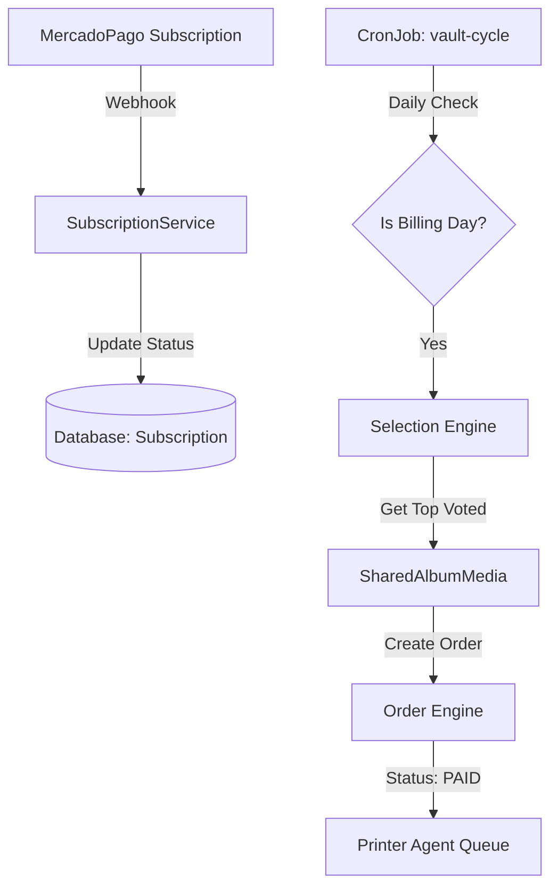

# SPEC-013: Recurring Billing Engine (Subscription System)

## 1. Context & Objectives

Esta fase implementa o Motor de Recorrência da Foto Segundo, permitindo que os "Cofres de Memórias" (Shared Albums) operem sob um modelo de assinatura mensal. O objetivo é automatizar a cobrança e o fechamento de ciclo (materialização de fotos) sem intervenção manual.

### Goals

- Implementar `SubscriptionService.ts` para gerenciar o ciclo de vida das assinaturas.
- Desenvolver o `vault-cycle.job.ts` (CronJob) para processar o fechamento mensal.
- Integrar a lógica de seleção de fotos baseada em votos/curtidas (Gamification).
- Automatizar a geração de ordens de produção (Zero Cost for client) após o faturamento.

## 2. Technical Architecture

## 3. Implementation Plan

### Step 1: Subscription Service

- `backend/src/services/subscription.service.ts`:
  - Métodos para criar assinatura no gateway.
  - Sincronização de status via Webhooks.
  - Verificação de limites de poses (planLimit).

### Step 2: Selection Engine (Closing Cycle)

- Lógica para buscar as fotos mais votadas no `SharedAlbum` até o `planLimit`.
- Integração com `MediaVote` model.

### Step 3: Automation Job

- `backend/src/jobs/vault-cycle.job.ts`:
  - Busca assinaturas com `nextBillingDate` <= HOJE.
  - Dispara o `Selection Engine`.
  - Cria `Order` com `paymentMethod: FREE` (Assinatura).

## 4. Acceptance Criteria (UAT)

1. [ ] Ao assinar um cofre, o status muda para `ACTIVE` no banco.
2. [ ] O robô de ciclo seleciona corretamente as X fotos mais curtidas do período.
3. [ ] Uma ordem de impressão é gerada automaticamente e aparece no log do Printer Agent.
4. [ ] O fechamento do ciclo reinicia o contador para o próximo mês.

## 5. Ambiguity Scoring

- **Technical Complexity**: 0.18 (Muitas peças móveis: Gateway, Cron, Seleção).
- **External Dependencies**: 0.25 (Webhooks de pagamento).
- **Scope Clarity**: 0.10 (Objetivo bem definido).
- **TOTAL AMBIGUITY**: 0.17 (Gate Passed)
