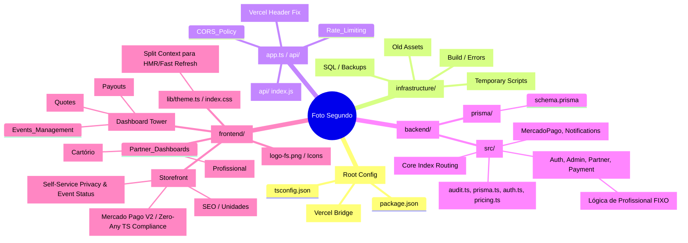

# Mind Map: Estrutura do Sistema Foto Segundo (V2.0)

Este mapa descreve a organização física e lógica do projeto, servindo como uma "bússola" para navegar entre o frontend React e o backend Express.

## 🧠 Mapa Mental Visual

---

## 📂 Descrição Detalhada de Pastas e Arquivos

### 1. Motor de Execução (backend/)

Onde reside toda a inteligência e segurança.

- **`src/app.ts`**: Coração do servidor. Configura segurança crítica (`trust proxy`), limites de requisição e orquestração de rotas.
- **`src/lib/audit.ts`**: Motor de rastreabilidade. Registra toda ação relevante no banco de dados.
- **`src/lib/auth.ts`**: Gestão de tokens JWT e RBAC (Role-Based Access Control).

### 2. Interface do Usuário (frontend/)

A "Pele" do sistema em Midnight Luxury.

- **`src/pages/admin/`**: O centro de controle administrativo ("Operações Centrais"). Inclui gestão de Eventos, Orçamentos (Leads) e Repasses Financeiros.
- **`src/pages/public/`**: Páginas de vitrine e landing pages customizadas para as **Unidades Fixas**.
- **`src/components/DashboardLayout`**: Estrutura visual adaptativa usada em todos os painéis internos.

### 3. Operações e Deploy

- **`vercel.json`**: Ponte de comunicação entre o domínio e o código, garantindo que `/api/*` chegue ao backend corretamente.
- **`package.json`**: Orquestra os builds de produção e dependências compartilhadas.
