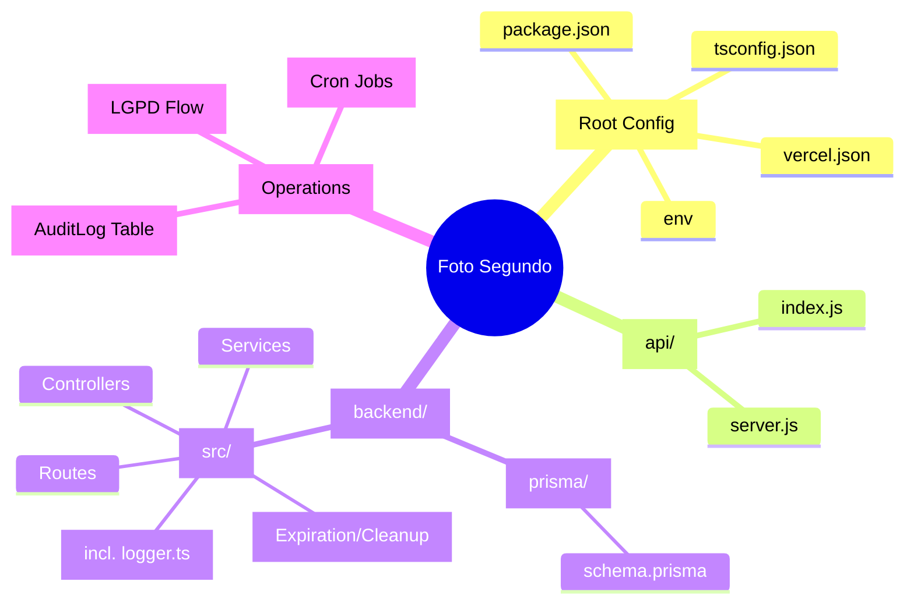

# Mind Map: Estrutura do Sistema Foto Segundo

Este mapa descreve a organização física e lógica do projeto, servindo como uma "bússola" para navegar entre o frontend React e o backend Express.

## 🧠 Mapa Mental Visual

---

## 📂 Descrição Detalhada de Pastas e Arquivos

### 1. Raiz do Projeto (Root)

Arquivos de configuração global que ditam como o sistema é construído e implantado.

- **`package.json`**: Gerencia scripts de build (ex: `vercel-build`) e dependências do projeto.
- **`vercel.json`**: Define as regras de roteamento da Vercel, separando chamadas de API (`/api/*`) do roteamento frontend.
- **`tsconfig.json`**: Configurações do compilador TypeScript.
- **`.env`**: (Oculto) Armazena chaves secretas como `DATABASE_URL` e `JWT_SECRET`.

### 2. `api/` (O Portal de Produção)

Esta pasta é usada pela Vercel para servir o backend como "Serverless Functions".

- **`index.js`**: O ponto de entrada que a Vercel chama. Ele carrega o servidor Express de forma preguiçosa (lazy load).
- **`server.js`**: O bundle compactado do backend gerado pelo `esbuild`.

### 3. `backend/` (O Motor do Sistema)

Onde reside toda a inteligência, segurança e comunicação com o banco de dados.

- **`prisma/`**: Contém o `schema.prisma`, que é a "única fonte da verdade" sobre o banco de dados.
- **`src/controllers/`**: Funções que processam as requisições (ex: `login`, `processPayment`).
- **`src/routes/`**: Define os endereços da API e quais permissões/autenticação são necessárias.
- **`src/lib/`**: Ferramentas compartilhadas, como a instância do Prisma e helpers de criptografia.

### 4. `frontend/` (A Pele do Sistema)

A interface de alta fidelidade "Midnight Luxury" com a qual os usuários interagem.

- **`public/`**: Logos, ícones e arquivos estáticos que não mudam.
- **`src/pages/`**: Cada arquivo aqui representa uma "tela" completa (Dashboard, Login, Vitrine).
- **`src/components/`**: Peças de interface reutilizáveis (Botões, Modais, GalleryView).
- **`src/contexts/`**: Controla o estado global (ex: `AuthContext` sabe quem está logado; `ThemeContext` controla as cores).
- **`src/hooks/`**: "Atalhos" de lógica (ex: `useAuth` para pegar dados do usuário logado).
- **`src/lib/api.ts`**: Configuração central do Axios para conversar com o backend.

---

