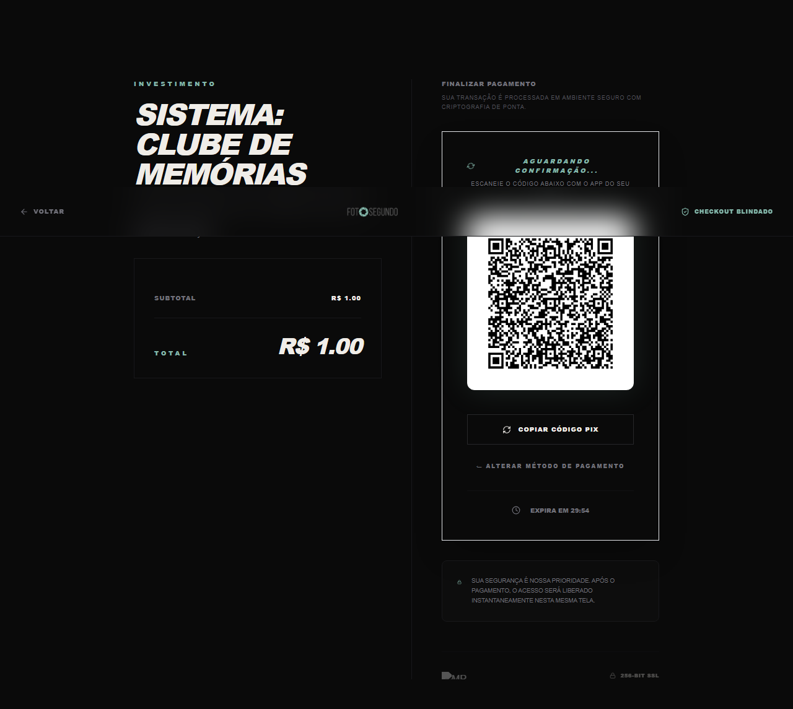

# 💎 Validação de Fluxo Financeiro (R$ 1,00)

Este documento contém o protocolo de validação real do sistema Foto Segundo.

### Detalhes do Pedido

- **Valor:** R$ 1,00
- **Order ID:** `cmouqvkvp0001vzxczmxmgcbd`
- **Data Gerada:** 07/05/2026
- **Status Esperado:** PAID (após pagamento)

### QR Code para Pagamento

Para validar que o sistema está processando pagamentos reais e atualizando o banco de dados via Webhook, por favor pague o PIX abaixo:

---
**Instruções para o Usuário:**

1. Abra o app do seu banco.
2. Escaneie o QR Code acima.
3. Confirme o pagamento de **R$ 1,00**.
4. Assim que o pagamento for confirmado, me avise para que eu possa verificar a atualização automática do banco de dados e prosseguir com os testes de usabilidade.
