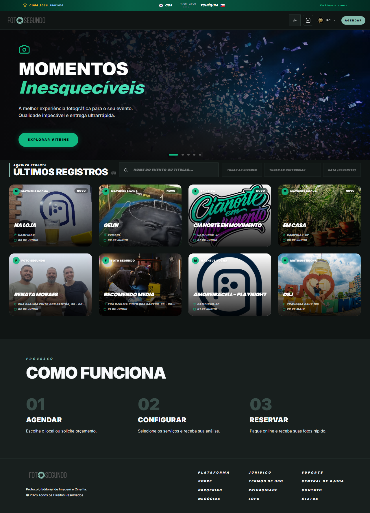

# Manual de Tela — **Home** — Vitrine pública, últimos eventos, CTA de agendamento

## ℹ️ Informações Gerais

- **URL:** `/`
- **Caminho Resolvido:** `/`
- **Nível de Acesso:** `Todos`
- **Título da Página (HTML):** `N/A`

## 📸 Captura da Tela

## 🌟 Títulos e Seções Encontradas

- MOMENTOS
Inesquecíveis
- ÚLTIMOS REGISTROS(8)
- NA LOJA
- GELIN
- CIANORTE EM MOVIMENTO
- EM CASA
- RENATA MORAES
- RECOMENDO MEDIA
- AMOREIRACELL - PLAYNIGHT
- DSJ
- COMO FUNCIONA
- AGENDAR
- CONFIGURAR
- RESERVAR

## 🔘 Ações e Botões Disponíveis

- **Botão:** `RC
▾`
- **Botão:** `AGENDAR`
- **Botão:** `EXPLORAR VITRINE`
- **Botão:** `Home`
- **Botão:** `Buscar`
- **Botão:** `Compras`
- **Botão:** `Meus Álbuns`
- **Botão:** `Opções`
- **Botão:** `Indique e Ganhe`
- **Botão:** `Meus Dados`

## 🔗 Links de Navegação

- **COPA 2026
PRÓXIMOS
COR
11/06 · 23:00
GRP A
TCHÉQUIA
Ver Álbum →** -> `/album-torcida`

## ⚙️ Observações Técnicas e Fluxo

1. **Acesso:** O carregamento requer privilégios de tipo `Todos`.
2. **Responsividade:** Layout testado em formato desktop (1280x1080) e mobile.
