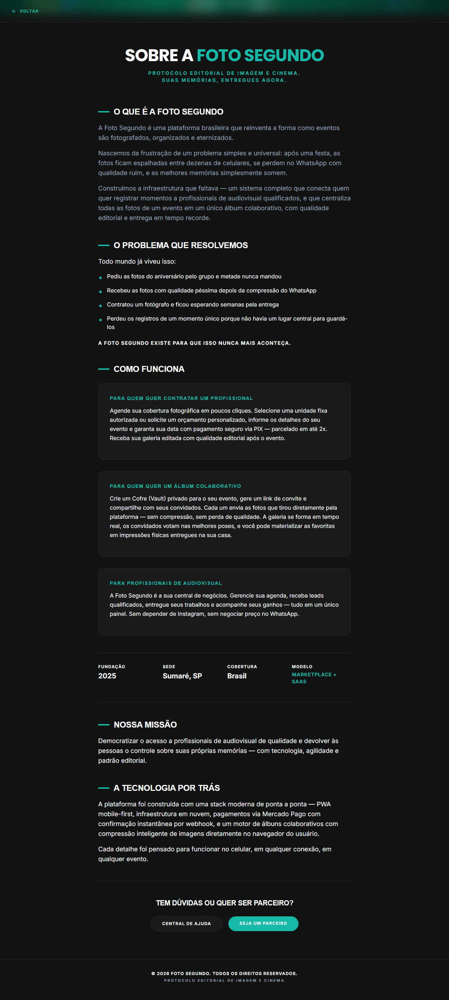

# Manual de Tela — **Sobre** — Apresentação da empresa e missão

## ℹ️ Informações Gerais

- **URL:** `/sobre`
- **Caminho Resolvido:** `/sobre`
- **Nível de Acesso:** `Todos`
- **Título da Página (HTML):** `Foto Segundo | Suas memórias, entregues agora.`

## 📸 Captura da Tela

## 🌟 Títulos e Seções Encontradas

- SOBRE A FOTO SEGUNDO
- O QUE É A FOTO SEGUNDO
- O PROBLEMA QUE RESOLVEMOS
- COMO FUNCIONA
- PARA QUEM QUER CONTRATAR UM PROFISSIONAL
- PARA QUEM QUER UM ÁLBUM COLABORATIVO
- PARA PROFISSIONAIS DE AUDIOVISUAL
- NOSSA MISSÃO
- A TECNOLOGIA POR TRÁS
- TEM DÚVIDAS OU QUER SER PARCEIRO?

## 🔘 Ações e Botões Disponíveis

- **Botão:** `Home`
- **Botão:** `Buscar`
- **Botão:** `Compras`
- **Botão:** `Meus Álbuns`
- **Botão:** `Opções`
- **Botão:** `Histórico de Compras`
- **Botão:** `Minha Carteira`
- **Botão:** `Indique e Ganhe`
- **Botão:** `Meus Dados`

## 🔗 Links de Navegação

- **COPA 2026
PRÓXIMOS
CANADÁ
12/06 · 16:00
GRP B
BÓSNIA
Ver Álbum →** -> `/album-torcida`
- **VOLTAR** -> `/`
- **CENTRAL DE AJUDA** -> `/suporte`
- **SEJA UM PARCEIRO** -> `/parcerias`

## ⚙️ Observações Técnicas e Fluxo

1. **Acesso:** O carregamento requer privilégios de tipo `Todos`.
2. **Responsividade:** Layout testado em formato desktop (1280x1080) e mobile.
