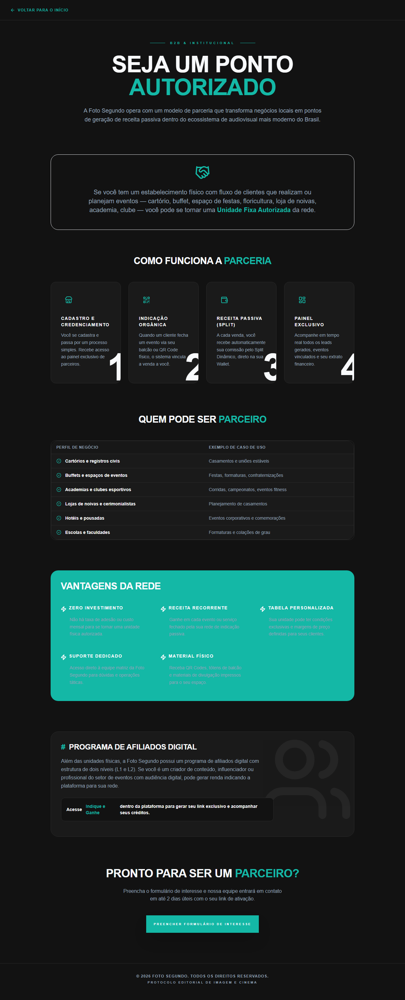

# Manual de Tela — **Parcerias** — Landing page para casas parceiras

## ℹ️ Informações Gerais

- **URL:** `/parcerias`
- **Caminho Resolvido:** `/parcerias`
- **Nível de Acesso:** `Todos`
- **Título da Página (HTML):** `Foto Segundo | Parcerias e Afiliados | Foto Segundo`

## 📸 Captura da Tela

## 🌟 Títulos e Seções Encontradas

- SEJA UM PONTO
AUTORIZADO
- COMO FUNCIONA A PARCERIA
- CADASTRO E CREDENCIAMENTO
- INDICAÇÃO ORGÂNICA
- RECEITA PASSIVA (SPLIT)
- PAINEL EXCLUSIVO
- QUEM PODE SER PARCEIRO
- VANTAGENS DA REDE
- ZERO INVESTIMENTO
- RECEITA RECORRENTE
- TABELA PERSONALIZADA
- SUPORTE DEDICADO
- MATERIAL FÍSICO
- #
PROGRAMA DE AFILIADOS DIGITAL
- PRONTO PARA SER UM PARCEIRO?

## 🔘 Ações e Botões Disponíveis

- **Botão:** `Home`
- **Botão:** `Buscar`
- **Botão:** `Compras`
- **Botão:** `Meus Álbuns`
- **Botão:** `Opções`
- **Botão:** `Histórico de Compras`
- **Botão:** `Álbum Sanfona`
- **Botão:** `Minha Carteira`
- **Botão:** `Indique e Ganhe`
- **Botão:** `Meus Dados`

## 🔗 Links de Navegação

- **VOLTAR PARA O INÍCIO** -> `/`
- **PREENCHER FORMULÁRIO DE INTERESSE** -> `/contato`

## ⚙️ Observações Técnicas e Fluxo

1. **Acesso:** O carregamento requer privilégios de tipo `Todos`.
2. **Responsividade:** Layout testado em formato desktop (1280x1080) e mobile.
