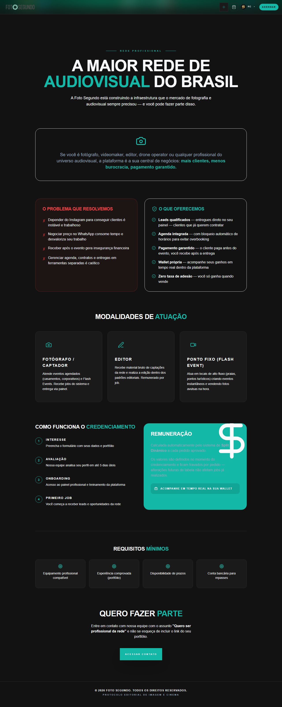

# Manual de Tela — **Negócios** — Landing page B2B para empresas

## ℹ️ Informações Gerais

- **URL:** `/negocios`
- **Caminho Resolvido:** `/negocios`
- **Nível de Acesso:** `Todos`
- **Título da Página (HTML):** `Foto Segundo | Negócios | Foto Segundo`

## 📸 Captura da Tela

## 🌟 Títulos e Seções Encontradas

- A MAIOR REDE DE
AUDIOVISUAL DO BRASIL
- O PROBLEMA QUE RESOLVEMOS
- O QUE OFERECEMOS
- MODALIDADES DE ATUAÇÃO
- FOTÓGRAFO / CAPTADOR
- EDITOR
- PONTO FIXO (FLASH EVENT)
- COMO FUNCIONA O CREDENCIAMENTO
- INTERESSE
- AVALIAÇÃO
- ONBOARDING
- PRIMEIRO JOB
- REMUNERAÇÃO
- REQUISITOS MÍNIMOS
- QUERO FAZER PARTE

## 🔘 Ações e Botões Disponíveis

- **Botão:** `RC
▾`
- **Botão:** `AGENDAR`
- **Botão:** `Home`
- **Botão:** `Buscar`
- **Botão:** `Compras`
- **Botão:** `Meus Álbuns`
- **Botão:** `Opções`
- **Botão:** `Histórico de Compras`
- **Botão:** `Minha Carteira`
- **Botão:** `Indique e Ganhe`
- **Botão:** `Meus Dados`

## 🔗 Links de Navegação

- **COPA 2026
PRÓXIMOS
SUÉCIA
14/06 · 23:00
GRP F
TUNÍSIA
Ver Álbum →** -> `/album-torcida`
- **VOLTAR PARA O INÍCIO** -> `/`
- **ACESSAR CONTATO** -> `/contato`

## ⚙️ Observações Técnicas e Fluxo

1. **Acesso:** O carregamento requer privilégios de tipo `Todos`.
2. **Responsividade:** Layout testado em formato desktop (1280x1080) e mobile.
