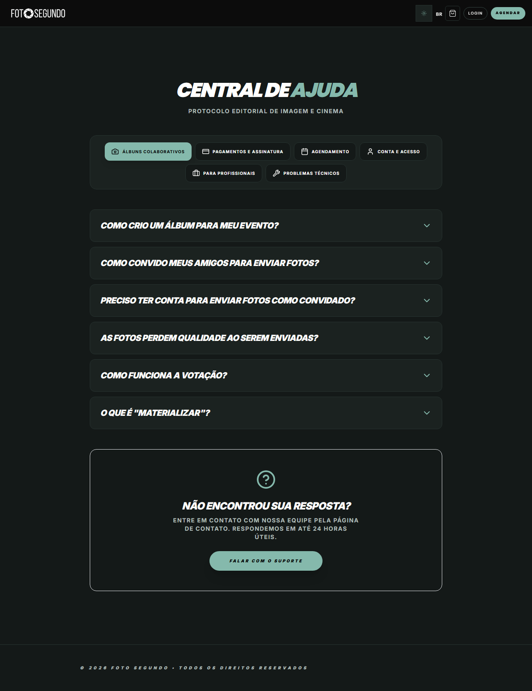

# Manual de Tela — **Central de Ajuda / Suporte**

## ℹ️ Informações Gerais

- **URL:** `/suporte`
- **Caminho Resolvido:** `/suporte`
- **Nível de Acesso:** `Todos`
- **Título da Página (HTML):** `Foto Segundo | Central de Ajuda | Foto Segundo`

## 📸 Captura da Tela

## 🌟 Títulos e Seções Encontradas

- CENTRAL DE AJUDA
- COMO CRIO UM ÁLBUM PARA MEU EVENTO?
- COMO CONVIDO MEUS AMIGOS PARA ENVIAR FOTOS?
- PRECISO TER CONTA PARA ENVIAR FOTOS COMO CONVIDADO?
- AS FOTOS PERDEM QUALIDADE AO SEREM ENVIADAS?
- COMO FUNCIONA A VOTAÇÃO?
- O QUE É "MATERIALIZAR"?
- NÃO ENCONTROU SUA RESPOSTA?

## 🔘 Ações e Botões Disponíveis

- **Botão:** `LOGIN`
- **Botão:** `AGENDAR`
- **Botão:** `ÁLBUNS COLABORATIVOS`
- **Botão:** `PAGAMENTOS E ASSINATURA`
- **Botão:** `AGENDAMENTO`
- **Botão:** `CONTA E ACESSO`
- **Botão:** `PARA PROFISSIONAIS`
- **Botão:** `PROBLEMAS TÉCNICOS`
- **Botão:** `COMO CRIO UM ÁLBUM PARA MEU EVENTO?`
- **Botão:** `COMO CONVIDO MEUS AMIGOS PARA ENVIAR FOTOS?`
- **Botão:** `PRECISO TER CONTA PARA ENVIAR FOTOS COMO CONVIDADO?`
- **Botão:** `AS FOTOS PERDEM QUALIDADE AO SEREM ENVIADAS?`
- **Botão:** `COMO FUNCIONA A VOTAÇÃO?`
- **Botão:** `O QUE É "MATERIALIZAR"?`
- **Botão:** `Home`
- **Botão:** `Buscar`
- **Botão:** `Opções`
- **Botão:** `Entrar`
- **Botão:** `Vitrine de Eventos`

## 🔗 Links de Navegação

- **FALAR COM O SUPORTE** -> `/contato`

## ⚙️ Observações Técnicas e Fluxo

1. **Acesso:** O carregamento requer privilégios de tipo `Todos`.
2. **Responsividade:** Layout testado em formato desktop (1280x1080) e mobile.
