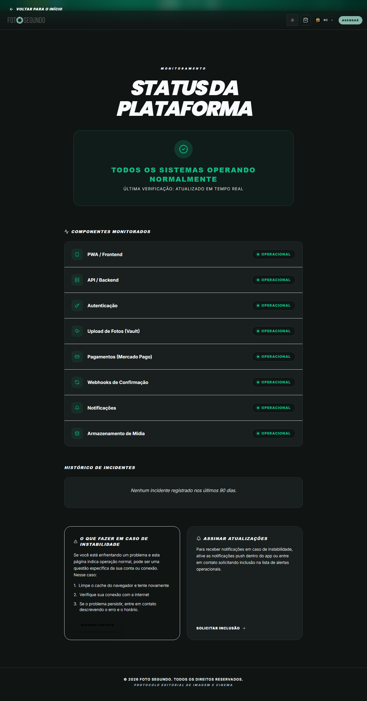

# Manual de Tela — **Status da Plataforma** — Monitoramento de saúde da API

## ℹ️ Informações Gerais

- **URL:** `/status`
- **Caminho Resolvido:** `/status`
- **Nível de Acesso:** `Todos`
- **Título da Página (HTML):** `Foto Segundo | Status do Sistema | Foto Segundo`

## 📸 Captura da Tela

## 🌟 Títulos e Seções Encontradas

- STATUS DA
PLATAFORMA
- TODOS OS SISTEMAS OPERANDO NORMALMENTE
- COMPONENTES MONITORADOS
- HISTÓRICO DE INCIDENTES
- O QUE FAZER EM CASO DE INSTABILIDADE
- ASSINAR ATUALIZAÇÕES

## 🔘 Ações e Botões Disponíveis

- **Botão:** `RC
▾`
- **Botão:** `AGENDAR`
- **Botão:** `Home`
- **Botão:** `Buscar`
- **Botão:** `Compras`
- **Botão:** `Meus Álbuns`
- **Botão:** `Opções`
- **Botão:** `Indique e Ganhe`
- **Botão:** `Meus Dados`

## 🔗 Links de Navegação

- **COPA 2026
PRÓXIMOS
MÉXICO
11/06 · 16:00
GRP A
ÁFR
Ver Álbum →** -> `/album-torcida`
- **VOLTAR PARA O INÍCIO** -> `/`
- **ACESSAR CONTATO** -> `/contato`
- **SOLICITAR INCLUSÃO** -> `/contato`

## ⚙️ Observações Técnicas e Fluxo

1. **Acesso:** O carregamento requer privilégios de tipo `Todos`.
2. **Responsividade:** Layout testado em formato desktop (1280x1080) e mobile.
