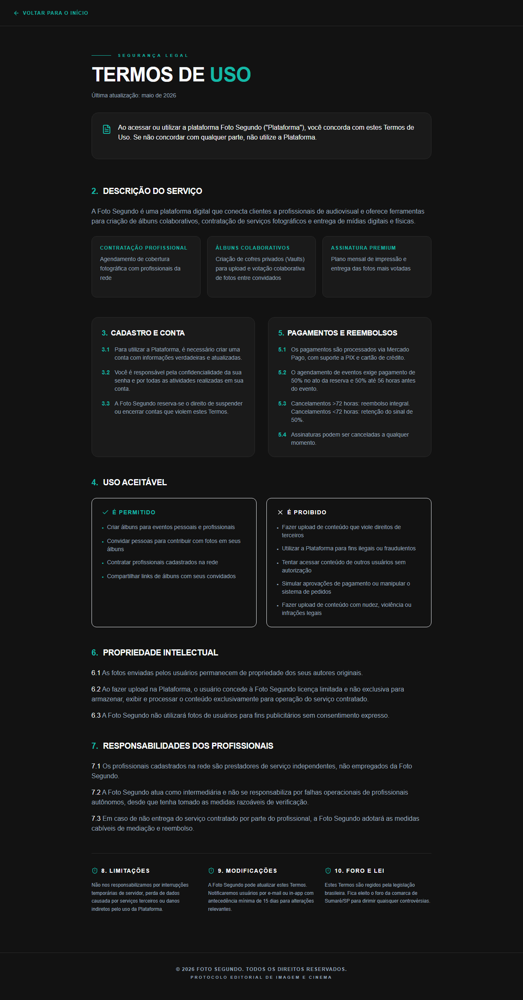

# Manual de Tela — **Termos de Uso**

## ℹ️ Informações Gerais

- **URL:** `/termos`
- **Caminho Resolvido:** `/termos`
- **Nível de Acesso:** `Todos`
- **Título da Página (HTML):** `Foto Segundo | Termos de Uso | Foto Segundo`

## 📸 Captura da Tela

## 🌟 Títulos e Seções Encontradas

- TERMOS DE USO
- 2.
DESCRIÇÃO DO SERVIÇO
- CONTRATAÇÃO PROFISSIONAL
- ÁLBUNS COLABORATIVOS
- ASSINATURA PREMIUM
- 3.
CADASTRO E CONTA
- 5.
PAGAMENTOS E REEMBOLSOS
- 4.
USO ACEITÁVEL
- É PERMITIDO
- É PROIBIDO
- 6.
PROPRIEDADE INTELECTUAL
- 7.
RESPONSABILIDADES DOS PROFISSIONAIS
- 8. LIMITAÇÕES
- 9. MODIFICAÇÕES
- 10. FORO E LEI

## 🔘 Ações e Botões Disponíveis

- **Botão:** `Home`
- **Botão:** `Buscar`
- **Botão:** `Compras`
- **Botão:** `Meus Álbuns`
- **Botão:** `Opções`
- **Botão:** `Histórico de Compras`
- **Botão:** `Álbum Sanfona`
- **Botão:** `Minha Carteira`
- **Botão:** `Indique e Ganhe`
- **Botão:** `Meus Dados`

## 🔗 Links de Navegação

- **VOLTAR PARA O INÍCIO** -> `/`

## ⚙️ Observações Técnicas e Fluxo

1. **Acesso:** O carregamento requer privilégios de tipo `Todos`.
2. **Responsividade:** Layout testado em formato desktop (1280x1080) e mobile.
