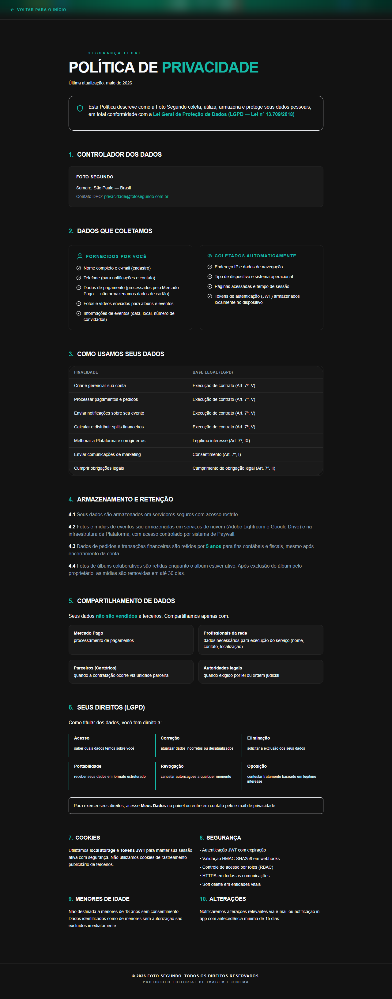

# Manual de Tela — **Política de Privacidade**

## ℹ️ Informações Gerais

- **URL:** `/privacidade`
- **Caminho Resolvido:** `/privacidade`
- **Nível de Acesso:** `Todos`
- **Título da Página (HTML):** `Foto Segundo | Política de Privacidade | Foto Segundo`

## 📸 Captura da Tela

## 🌟 Títulos e Seções Encontradas

- POLÍTICA DE PRIVACIDADE
- 1.

CONTROLADOR DOS DADOS

- 1.

DADOS QUE COLETAMOS

- FORNECIDOS POR VOCÊ
- COLETADOS AUTOMATICAMENTE
- 1.

COMO USAMOS SEUS DADOS

- 1.

ARMAZENAMENTO E RETENÇÃO

- 1.

COMPARTILHAMENTO DE DADOS

- 1.

SEUS DIREITOS (LGPD)

- 1.

COOKIES

- 1.

SEGURANÇA

- 1.

MENORES DE IDADE

- 1.

ALTERAÇÕES

## 🔘 Ações e Botões Disponíveis

- **Botão:** `Home`
- **Botão:** `Buscar`
- **Botão:** `Compras`
- **Botão:** `Meus Álbuns`
- **Botão:** `Opções`
- **Botão:** `Histórico de Compras`
- **Botão:** `Álbum Sanfona`
- **Botão:** `Minha Carteira`
- **Botão:** `Indique e Ganhe`
- **Botão:** `Meus Dados`

## 🔗 Links de Navegação

- **VOLTAR PARA O INÍCIO** -> `/`
- **<privacidade@fotosegundo.com.br>** -> `mailto:privacidade@fotosegundo.com.br`

## ⚙️ Observações Técnicas e Fluxo

1. **Acesso:** O carregamento requer privilégios de tipo `Todos`.
2. **Responsividade:** Layout testado em formato desktop (1280x1080) e mobile.
