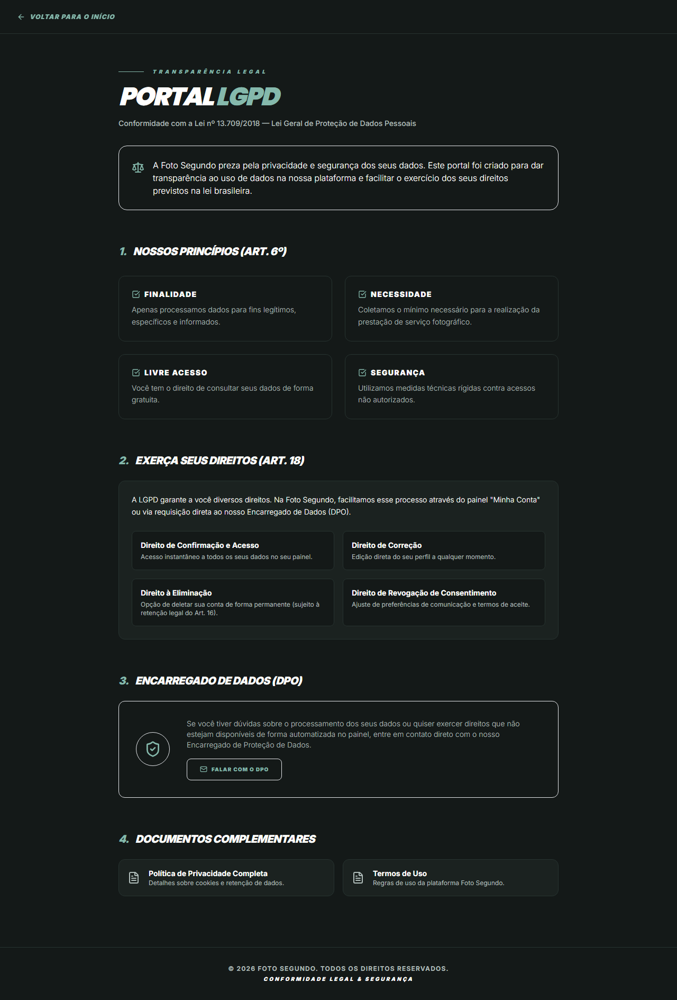

# Manual de Tela — **LGPD** — Política de dados pessoais

## ℹ️ Informações Gerais

- **URL:** `/lgpd`
- **Caminho Resolvido:** `/lgpd`
- **Nível de Acesso:** `Todos`
- **Título da Página (HTML):** `Foto Segundo | Portal LGPD | Foto Segundo`

## 📸 Captura da Tela

## 🌟 Títulos e Seções Encontradas

- PORTAL LGPD
- 1.
NOSSOS PRINCÍPIOS (ART. 6º)
- FINALIDADE
- NECESSIDADE
- LIVRE ACESSO
- SEGURANÇA
- 2.
EXERÇA SEUS DIREITOS (ART. 18)
- 3.
ENCARREGADO DE DADOS (DPO)
- 4.
DOCUMENTOS COMPLEMENTARES

## 🔘 Ações e Botões Disponíveis

- **Botão:** `Home`
- **Botão:** `Buscar`
- **Botão:** `Opções`
- **Botão:** `Entrar`
- **Botão:** `Vitrine de Eventos`

## 🔗 Links de Navegação

- **VOLTAR PARA O INÍCIO** -> `/`
- **FALAR COM O DPO** -> `mailto:dpo@fotosegundo.com.br`
- **Política de Privacidade Completa

Detalhes sobre cookies e retenção de dados.** -> `/privacidade`
- **Termos de Uso

Regras de uso da plataforma Foto Segundo.** -> `/termos`

## ⚙️ Observações Técnicas e Fluxo

1. **Acesso:** O carregamento requer privilégios de tipo `Todos`.
2. **Responsividade:** Layout testado em formato desktop (1280x1080) e mobile.
