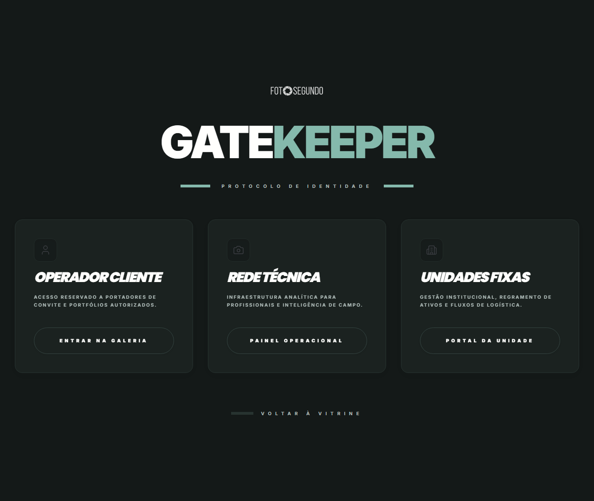

# Manual de Tela — **Seleção de Tipo de Acesso** — Escolha entre cliente/profissional

## ℹ️ Informações Gerais

- **URL:** `/auth`
- **Caminho Resolvido:** `/auth`
- **Nível de Acesso:** `Público`
- **Título da Página (HTML):** `Foto Segundo | Suas memórias, entregues agora.`

## 📸 Captura da Tela

## 🌟 Títulos e Seções Encontradas

- GATEKEEPER
- OPERADOR CLIENTE
- REDE TÉCNICA
- UNIDADES FIXAS

## 🔘 Ações e Botões Disponíveis

- **Botão:** `ENTRAR NA GALERIA`
- **Botão:** `PAINEL OPERACIONAL`
- **Botão:** `PORTAL DA UNIDADE`
- **Botão:** `VOLTAR À VITRINE`
- **Botão:** `Home`
- **Botão:** `Buscar`
- **Botão:** `Opções`
- **Botão:** `Entrar`
- **Botão:** `Vitrine de Eventos`

## 🔗 Links de Navegação

*Nenhum link de navigation detectado.*

## ⚙️ Observações Técnicas e Fluxo

1. **Acesso:** O carregamento requer privilégios de tipo `Público`.
2. **Responsividade:** Layout testado em formato desktop (1280x1080) e mobile.
