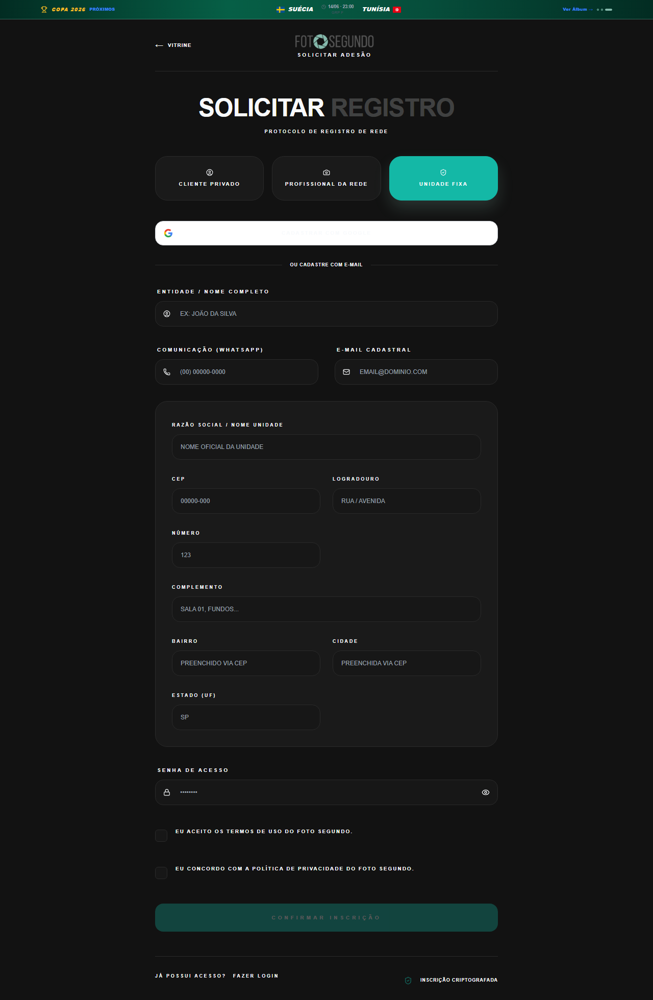

# Manual de Tela — **Cadastro** — Criação de conta (Modalidade Unidade/Ponto Fixo)

## ℹ️ Informações Gerais

- **URL:** `/registro?role=UNIDADE`
- **Caminho Resolvido:** `/registro?role=UNIDADE`
- **Nível de Acesso:** `Público`
- **Título da Página (HTML):** `Registro — Foto Segundo`

## 📸 Captura da Tela

## 🌟 Títulos e Seções Encontradas

- SOLICITAR REGISTRO

## 🔘 Ações e Botões Disponíveis

- **Botão:** `←
VITRINE`
- **Botão:** `CLIENTE PRIVADO`
- **Botão:** `PROFISSIONAL DA REDE`
- **Botão:** `UNIDADE FIXA`
- **Botão:** `CONFIRMAR INSCRIÇÃO`
- **Botão:** `Home`
- **Botão:** `Buscar`
- **Botão:** `Compras`
- **Botão:** `Meus Álbuns`
- **Botão:** `Opções`
- **Botão:** `Histórico de Compras`
- **Botão:** `Minha Carteira`
- **Botão:** `Indique e Ganhe`
- **Botão:** `Meus Dados`

## 🔗 Links de Navegação

- **COPA 2026
PRÓXIMOS
MÉXICO
11/06 · 16:00
GRP A
ÁFR
Ver Álbum →** -> `/album-torcida`
- **FAZER LOGIN** -> `/login`

## ⚙️ Observações Técnicas e Fluxo

1. **Acesso:** O carregamento requer privilégios de tipo `Público`.
2. **Responsividade:** Layout testado em formato desktop (1280x1080) e mobile.
