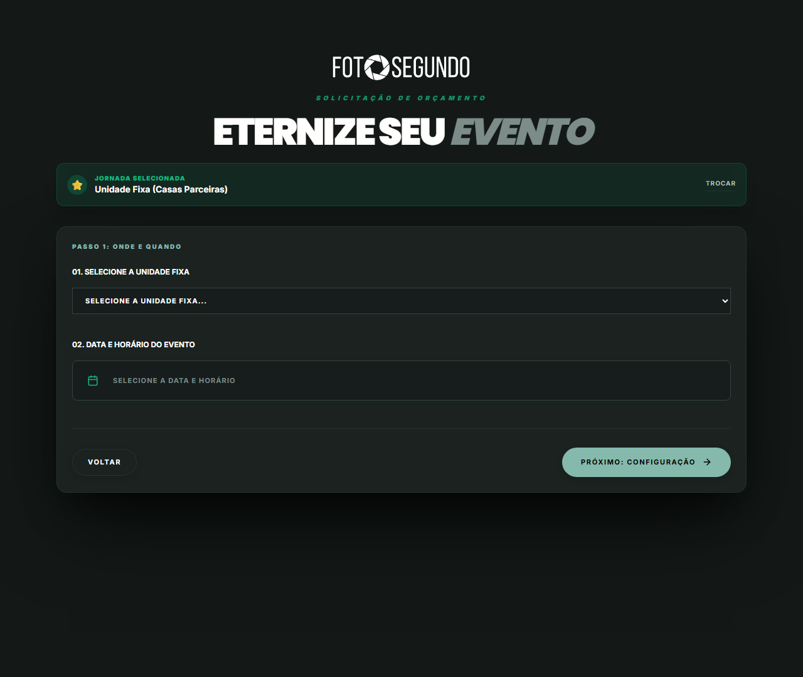

# Manual de Tela — **Unidades Fixas** — Fluxo para casas parceiras com serviços específicos

## ℹ️ Informações Gerais

- **URL:** `/cotacao/unidades`
- **Caminho Resolvido:** `/cotacao/unidades`
- **Nível de Acesso:** `Público`
- **Título da Página (HTML):** `Foto Segundo | Suas memórias, entregues agora.`

## 📸 Captura da Tela

## 🌟 Títulos e Seções Encontradas

- ETERNIZE SEU EVENTO

## 🔘 Ações e Botões Disponíveis

- **Botão:** `TROCAR`
- **Botão:** `VOLTAR`
- **Botão:** `PRÓXIMO: CONFIGURAÇÃO`

## 🔗 Links de Navegação

*Nenhum link de navigation detectado.*

## ⚙️ Observações Técnicas e Fluxo

1. **Acesso:** O carregamento requer privilégios de tipo `Público`.
2. **Responsividade:** Layout testado em formato desktop (1280x1080) e mobile.
