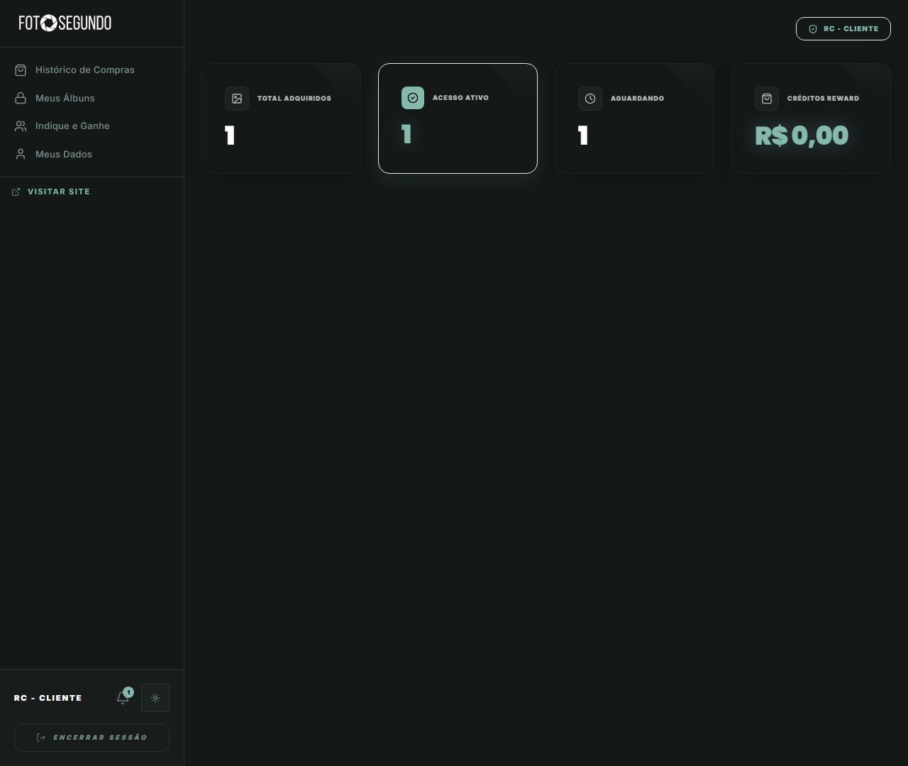

# Manual de Tela — **Aba: Perfil** — Dados pessoais e foto

## ℹ️ Informações Gerais

- **URL:** `/minha-conta?s=perfil`
- **Caminho Resolvido:** `/minha-conta?s=perfil`
- **Nível de Acesso:** `Autenticado`
- **Título da Página (HTML):** `Foto Segundo | Suas memórias, entregues agora.`

## 📸 Captura da Tela

## 🌟 Títulos e Seções Encontradas

*Nenhum título H1/H2/H3 detectado.*

## 🔘 Ações e Botões Disponíveis

- **Botão:** `Histórico de Compras`
- **Botão:** `Meus Álbuns`
- **Botão:** `Indique e Ganhe`
- **Botão:** `Meus Dados`
- **Botão:** `1`
- **Botão:** `ENCERRAR SESSÃO`
- **Botão:** `Encerrar Sessão`
- **Botão:** `Home`
- **Botão:** `Buscar`
- **Botão:** `Compras`
- **Botão:** `Opções`

## 🔗 Links de Navegação

- **VISITAR SITE** -> `/`
- **Visitar Site** -> `/`

## ⚙️ Observações Técnicas e Fluxo

1. **Acesso:** O carregamento requer privilégios de tipo `Autenticado`.
2. **Responsividade:** Layout testado em formato desktop (1280x1080) e mobile.
