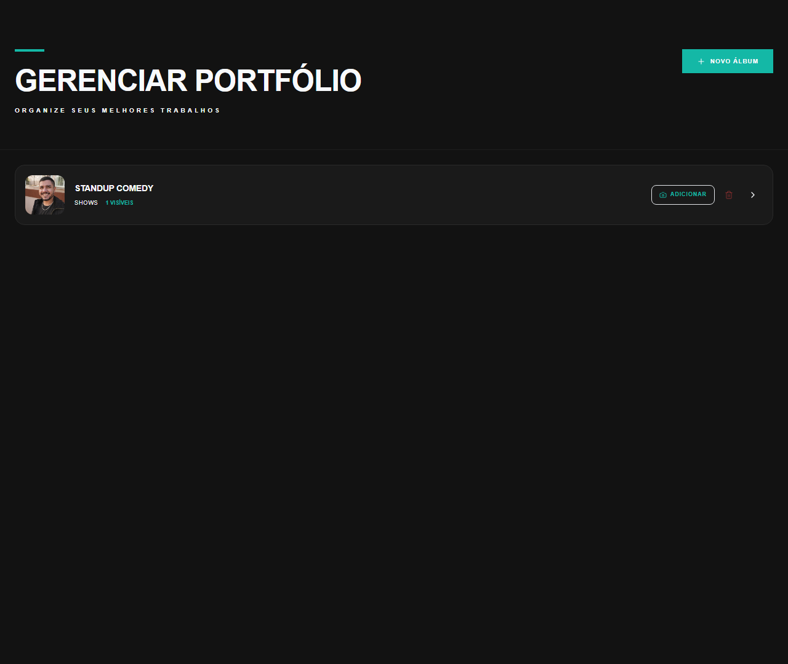

# Manual de Tela — **Aba: Portfólio** — Gestão do portfólio

## ℹ️ Informações Gerais

- **URL:** `/profissional/portfolio`
- **Caminho Resolvido:** `/profissional/portfolio`
- **Nível de Acesso:** `PROFISSIONAL`
- **Título da Página (HTML):** `Foto Segundo | Suas memórias, entregues agora.`

## 📸 Captura da Tela

## 🌟 Títulos e Seções Encontradas

- GERENCIAR PORTFÓLIO
- STANDUP COMEDY

## 🔘 Ações e Botões Disponíveis

- **Botão:** `NOVO ÁLBUM`

## 🔗 Links de Navegação

*Nenhum link de navigation detectado.*

## ⚙️ Observações Técnicas e Fluxo

1. **Acesso:** O carregamento requer privilégios de tipo `PROFISSIONAL`.
2. **Responsividade:** Layout testado em formato desktop (1280x1080) e mobile.
