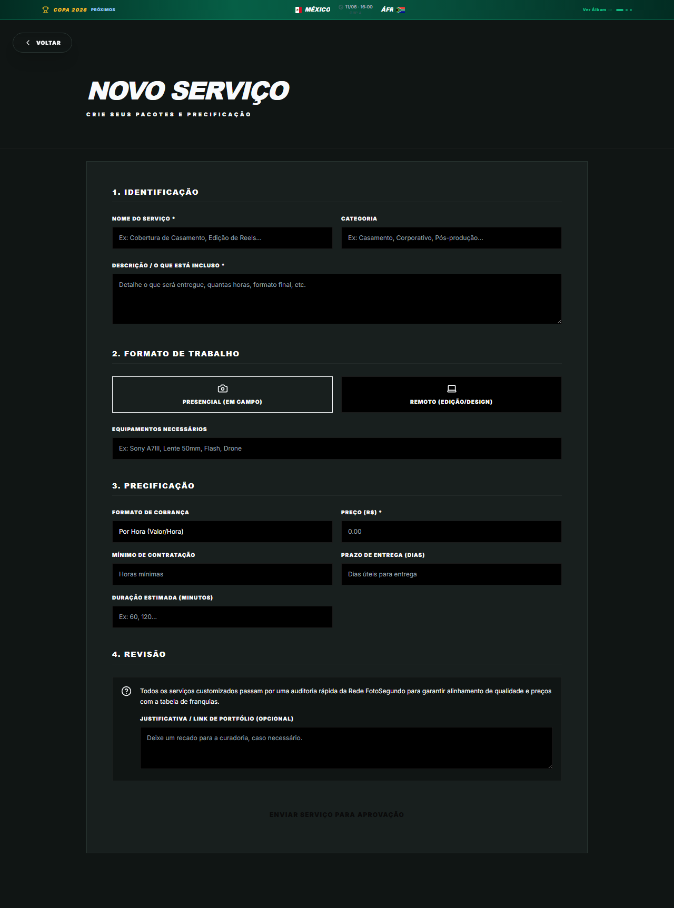

# Manual de Tela — **Novo Serviço Customizado** — Formulário para criar serviço sob medida

## ℹ️ Informações Gerais

- **URL:** `/profissional/novo-servico`
- **Caminho Resolvido:** `/profissional/novo-servico`
- **Nível de Acesso:** `PROFISSIONAL`
- **Título da Página (HTML):** `Foto Segundo | Suas memórias, entregues agora.`

## 📸 Captura da Tela

## 🌟 Títulos e Seções Encontradas

- NOVO SERVIÇO
- 1. IDENTIFICAÇÃO
- 2. FORMATO DE TRABALHO
- 3. PRECIFICAÇÃO
- 4. REVISÃO

## 🔘 Ações e Botões Disponíveis

- **Botão:** `VOLTAR`
- **Botão:** `ENVIAR SERVIÇO PARA APROVAÇÃO`
- **Botão:** `Home`
- **Botão:** `Buscar`
- **Botão:** `Compras`
- **Botão:** `Meus Álbuns`
- **Botão:** `Opções`
- **Botão:** `Indique e Ganhe`
- **Botão:** `Meus Dados`
- **Botão:** `Minha Agenda`
- **Botão:** `Meu Portfólio`
- **Botão:** `Serviços & Preços`
- **Botão:** `Ficha Técnica & Pix`
- **Botão:** `Vendas & Ganhos`
- **Botão:** `Gestão de Franquia`
- **Botão:** `Rede Técnica`
- **Botão:** `Franquia Print`

## 🔗 Links de Navegação

- **COPA 2026
PRÓXIMOS
MÉXICO
11/06 · 16:00
GRP A
ÁFR
Ver Álbum →** -> `/album-torcida`

## ⚙️ Observações Técnicas e Fluxo

1. **Acesso:** O carregamento requer privilégios de tipo `PROFISSIONAL`.
2. **Responsividade:** Layout testado em formato desktop (1280x1080) e mobile.
