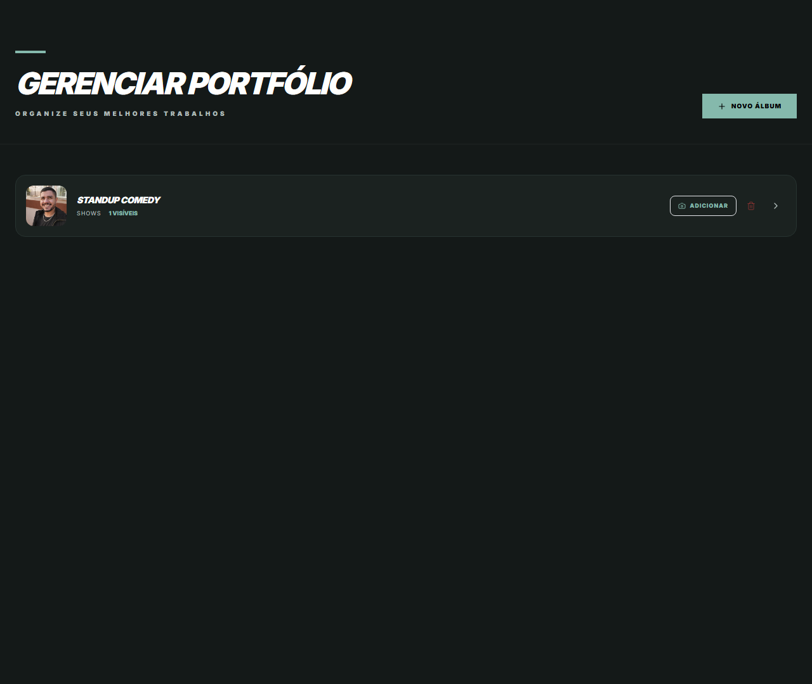

# Manual de Tela — **Gestão de Portfólio** — Upload e organização de fotos

## ℹ️ Informações Gerais

- **URL:** `/profissional/portfolio`
- **Caminho Resolvido:** `/profissional/portfolio`
- **Nível de Acesso:** `PROFISSIONAL`
- **Título da Página (HTML):** `Foto Segundo | Suas memórias, entregues agora.`

## 📸 Captura da Tela

## 🌟 Títulos e Seções Encontradas

- GERENCIAR PORTFÓLIO
- STANDUP COMEDY

## 🔘 Ações e Botões Disponíveis

- **Botão:** `NOVO ÁLBUM`
- **Botão:** `Home`
- **Botão:** `Buscar`
- **Botão:** `Compras`
- **Botão:** `Meus Álbuns`
- **Botão:** `Opções`
- **Botão:** `Indique e Ganhe`
- **Botão:** `Meus Dados`
- **Botão:** `Minha Agenda`
- **Botão:** `Meu Portfólio`
- **Botão:** `Serviços & Preços`
- **Botão:** `Ficha Técnica & Pix`
- **Botão:** `Vendas & Ganhos`
- **Botão:** `Rede Técnica`
- **Botão:** `Franquia Print`

## 🔗 Links de Navegação

*Nenhum link de navigation detectado.*

## ⚙️ Observações Técnicas e Fluxo

1. **Acesso:** O carregamento requer privilégios de tipo `PROFISSIONAL`.
2. **Responsividade:** Layout testado em formato desktop (1280x1080) e mobile.
