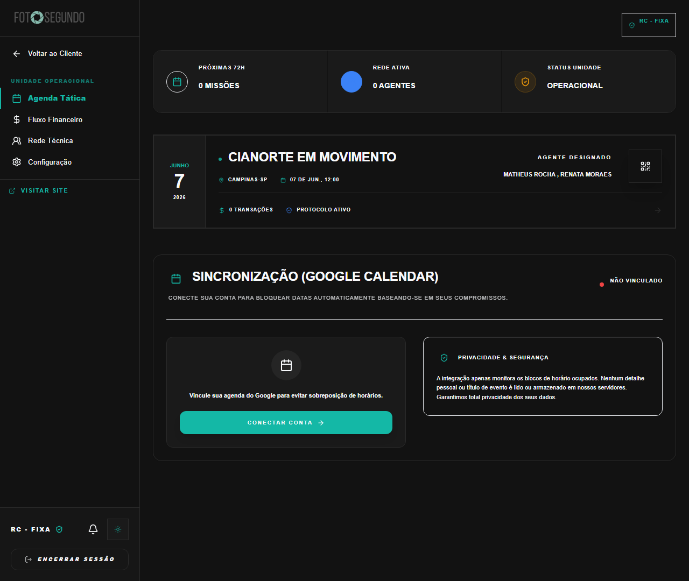

# Manual de Tela — **Dashboard da Unidade** — Gestão de eventos da casa parceira

## ℹ️ Informações Gerais

- **URL:** `/unidade-fixa`
- **Caminho Resolvido:** `/unidade-fixa`
- **Nível de Acesso:** `CARTORIO / UNIDADE`
- **Título da Página (HTML):** `Foto Segundo | Suas memórias, entregues agora.`

## 📸 Captura da Tela

## 🌟 Títulos e Seções Encontradas

- CIANORTE EM MOVIMENTO
- SINCRONIZAÇÃO (GOOGLE CALENDAR)

## 🔘 Ações e Botões Disponíveis

- **Botão:** `Voltar ao Cliente`
- **Botão:** `Agenda Tática`
- **Botão:** `Fluxo Financeiro`
- **Botão:** `Rede Técnica`
- **Botão:** `Configuração`
- **Botão:** `ENCERRAR SESSÃO`
- **Botão:** `Encerrar Sessão`
- **Botão:** `CONECTAR CONTA`
- **Botão:** `Menu`

## 🔗 Links de Navegação

- **VISITAR SITE** -> `/`
- **Visitar Site** -> `/`

## ⚙️ Observações Técnicas e Fluxo

1. **Acesso:** O carregamento requer privilégios de tipo `CARTORIO / UNIDADE`.
2. **Responsividade:** Layout testado em formato desktop (1280x1080) e mobile.
