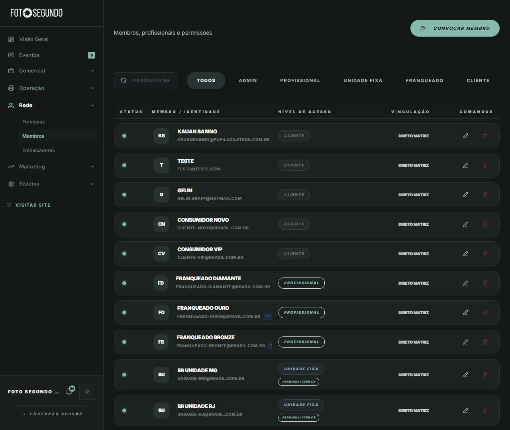

# Manual de Tela — **Admin: Usuários** — Gestão de todos os usuários

## ℹ️ Informações Gerais

- **URL:** `/admin?s=usuarios`
- **Caminho Resolvido:** `/admin/users`
- **Nível de Acesso:** `ADMIN`
- **Título da Página (HTML):** `Foto Segundo | Suas memórias, entregues agora.`

## 📸 Captura da Tela

## 🌟 Títulos e Seções Encontradas

*Nenhum título H1/H2/H3 detectado.*

## 🔘 Ações e Botões Disponíveis

- **Botão:** `Visão Geral`
- **Botão:** `Eventos
9`
- **Botão:** `Comercial`
- **Botão:** `Operação`
- **Botão:** `Rede`
- **Botão:** `Franquias`
- **Botão:** `Membros`
- **Botão:** `Embaixadores`
- **Botão:** `Marketing`
- **Botão:** `Sistema`
- **Botão:** `56`
- **Botão:** `ENCERRAR SESSÃO`
- **Botão:** `Eventos9`
- **Botão:** `Encerrar Sessão`
- **Botão:** `CONVOCAR MEMBRO`
- **Botão:** `TODOS`
- **Botão:** `ADMIN`
- **Botão:** `PROFISSIONAL`
- **Botão:** `UNIDADE FIXA`
- **Botão:** `FRANQUEADO`
- **Botão:** `CLIENTE`
- **Botão:** `Home`
- **Botão:** `Buscar`
- **Botão:** `Compras`
- **Botão:** `Meus Álbuns`
- **Botão:** `Opções`
- **Botão:** `Indique e Ganhe`
- **Botão:** `Meus Dados`
- **Botão:** `Painel Central`

## 🔗 Links de Navegação

- **VISITAR SITE** -> `/`
- **Visitar Site** -> `/`

## ⚙️ Observações Técnicas e Fluxo

1. **Acesso:** O carregamento requer privilégios de tipo `ADMIN`.
2. **Responsividade:** Layout testado em formato desktop (1280x1080) e mobile.
