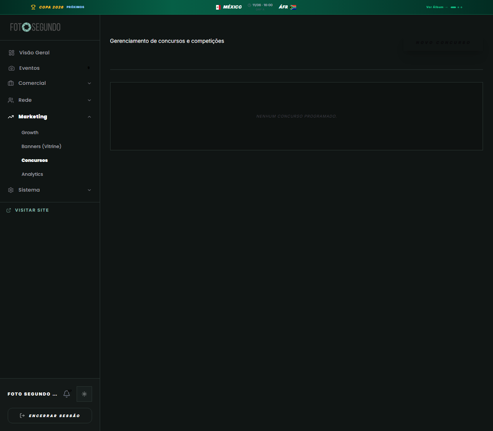

# Manual de Tela — **Admin: Concursos** — Gestão de competições fotográficas

## ℹ️ Informações Gerais

- **URL:** `/admin/contests`
- **Caminho Resolvido:** `/admin/contests`
- **Nível de Acesso:** `ADMIN`
- **Título da Página (HTML):** `Foto Segundo | Suas memórias, entregues agora.`

## 📸 Captura da Tela

## 🌟 Títulos e Seções Encontradas

*Nenhum título H1/H2/H3 detectado.*

## 🔘 Ações e Botões Disponíveis

- **Botão:** `Visão Geral`
- **Botão:** `Eventos
9`
- **Botão:** `Comercial`
- **Botão:** `Rede`
- **Botão:** `Marketing`
- **Botão:** `Growth`
- **Botão:** `Banners (Vitrine)`
- **Botão:** `Concursos`
- **Botão:** `Analytics`
- **Botão:** `Sistema`
- **Botão:** `57`
- **Botão:** `ENCERRAR SESSÃO`
- **Botão:** `Eventos9`
- **Botão:** `Encerrar Sessão`
- **Botão:** `NOVO CONCURSO`

## 🔗 Links de Navegação

- **COPA 2026
PRÓXIMOS
MÉXICO
11/06 · 16:00
GRP A
ÁFR
Ver Álbum →** -> `/album-torcida`
- **VISITAR SITE** -> `/`
- **Visitar Site** -> `/`

## ⚙️ Observações Técnicas e Fluxo

1. **Acesso:** O carregamento requer privilégios de tipo `ADMIN`.
2. **Responsividade:** Layout testado em formato desktop (1280x1080) e mobile.
