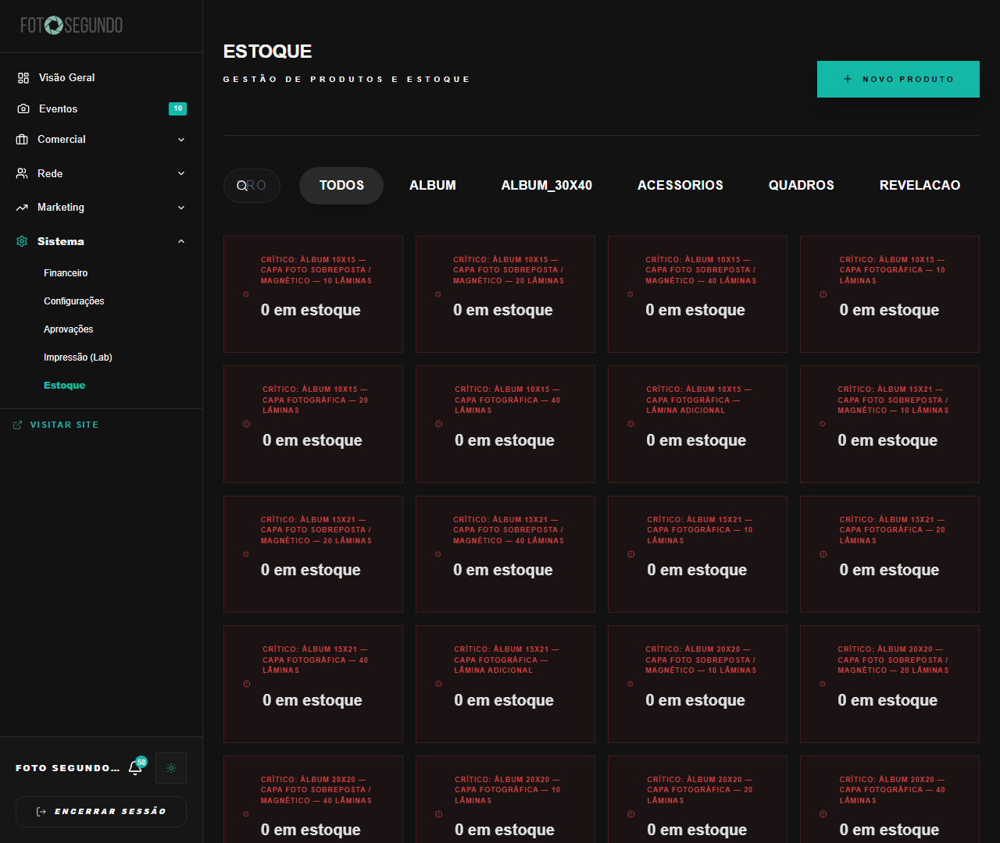

# Manual de Tela — **Admin: Estoque** — Controle de insumos e materiais

## ℹ️ Informações Gerais

- **URL:** `/admin/inventory`
- **Caminho Resolvido:** `/admin/inventory`
- **Nível de Acesso:** `ADMIN`
- **Título da Página (HTML):** `Foto Segundo | Suas memórias, entregues agora.`

## 📸 Captura da Tela

## 🌟 Títulos e Seções Encontradas

- ESTOQUE

## 🔘 Ações e Botões Disponíveis

- **Botão:** `Visão Geral`
- **Botão:** `Eventos
10`
- **Botão:** `Comercial`
- **Botão:** `Rede`
- **Botão:** `Marketing`
- **Botão:** `Sistema`
- **Botão:** `Financeiro`
- **Botão:** `Configurações`
- **Botão:** `Aprovações`
- **Botão:** `Impressão (Lab)`
- **Botão:** `Estoque`
- **Botão:** `58`
- **Botão:** `ENCERRAR SESSÃO`
- **Botão:** `Eventos10`
- **Botão:** `Encerrar Sessão`
- **Botão:** `NOVO PRODUTO`
- **Botão:** `TODOS`
- **Botão:** `ALBUM`
- **Botão:** `ALBUM_30X40`
- **Botão:** `ACESSORIOS`
- **Botão:** `QUADROS`
- **Botão:** `REVELACAO`
- **Botão:** `Eventos`
- **Botão:** `Menu`

## 🔗 Links de Navegação

- **VISITAR SITE** -> `/`
- **Visitar Site** -> `/`

## ⚙️ Observações Técnicas e Fluxo

1. **Acesso:** O carregamento requer privilégios de tipo `ADMIN`.
2. **Responsividade:** Layout testado em formato desktop (1280x1080) e mobile.
