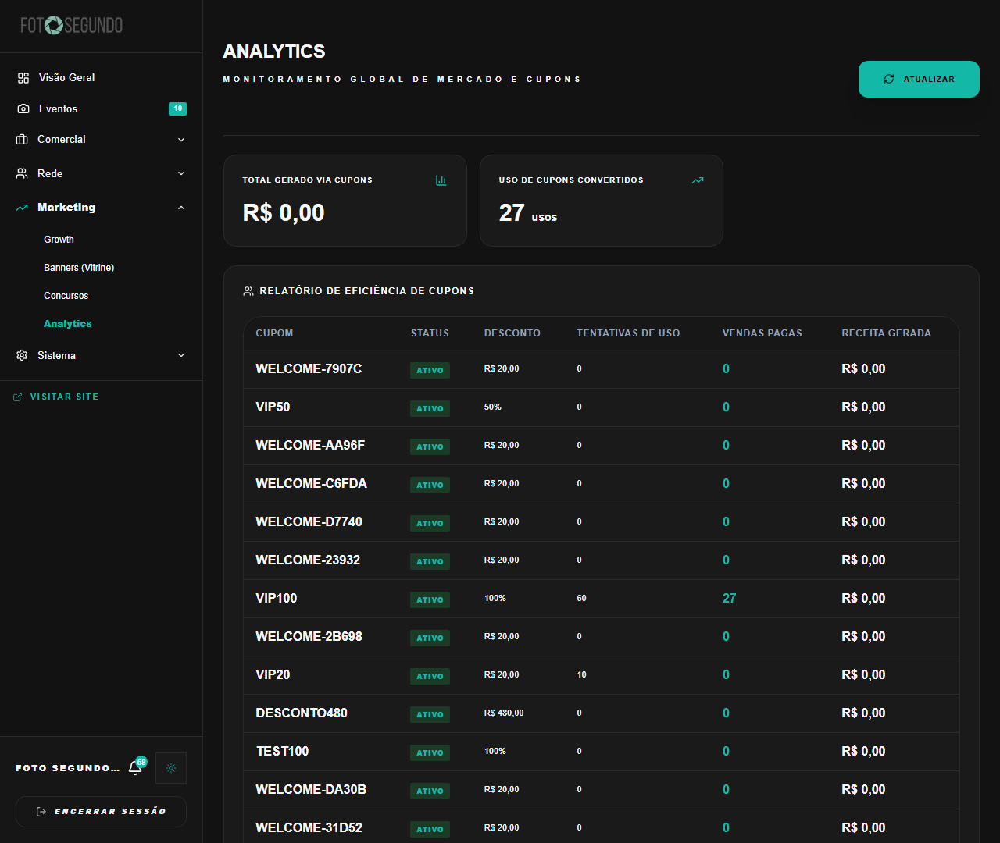

# Manual de Tela — **Admin: Analytics** — Relatórios e dados de uso

## ℹ️ Informações Gerais

- **URL:** `/admin/analytics`
- **Caminho Resolvido:** `/admin/analytics`
- **Nível de Acesso:** `ADMIN`
- **Título da Página (HTML):** `Foto Segundo | Suas memórias, entregues agora.`

## 📸 Captura da Tela

## 🌟 Títulos e Seções Encontradas

- ANALYTICS
- RELATÓRIO DE EFICIÊNCIA DE CUPONS

## 🔘 Ações e Botões Disponíveis

- **Botão:** `Visão Geral`
- **Botão:** `Eventos
10`
- **Botão:** `Comercial`
- **Botão:** `Rede`
- **Botão:** `Marketing`
- **Botão:** `Growth`
- **Botão:** `Banners (Vitrine)`
- **Botão:** `Concursos`
- **Botão:** `Analytics`
- **Botão:** `Sistema`
- **Botão:** `58`
- **Botão:** `ENCERRAR SESSÃO`
- **Botão:** `Eventos10`
- **Botão:** `Encerrar Sessão`
- **Botão:** `ATUALIZAR`
- **Botão:** `Eventos`
- **Botão:** `Menu`

## 🔗 Links de Navegação

- **VISITAR SITE** -> `/`
- **Visitar Site** -> `/`

## ⚙️ Observações Técnicas e Fluxo

1. **Acesso:** O carregamento requer privilégios de tipo `ADMIN`.
2. **Responsividade:** Layout testado em formato desktop (1280x1080) e mobile.
