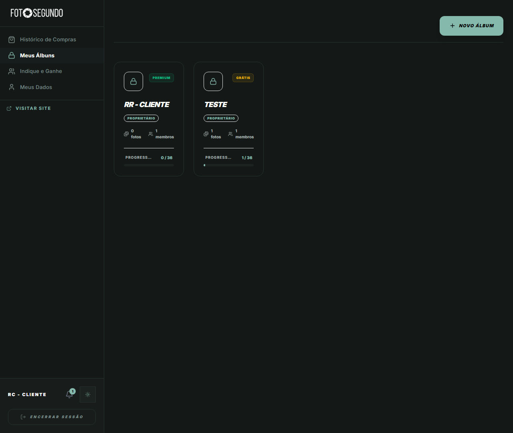

# Manual de Tela — **Gestão de Álbuns (Vaults)** — Cofres de fotos do usuário

## ℹ️ Informações Gerais

- **URL:** `/meus-albuns`
- **Caminho Resolvido:** `/meus-albuns`
- **Nível de Acesso:** `Autenticado`
- **Título da Página (HTML):** `Meus Álbuns | Foto Segundo`

## 📸 Captura da Tela

## 🌟 Títulos e Seções Encontradas

- RR - CLIENTE
- TESTE

## 🔘 Ações e Botões Disponíveis

- **Botão:** `Histórico de Compras`
- **Botão:** `Meus Álbuns`
- **Botão:** `Indique e Ganhe`
- **Botão:** `Meus Dados`
- **Botão:** `1`
- **Botão:** `ENCERRAR SESSÃO`
- **Botão:** `Encerrar Sessão`
- **Botão:** `NOVO ÁLBUM`
- **Botão:** `Home`
- **Botão:** `Buscar`
- **Botão:** `Compras`
- **Botão:** `Opções`

## 🔗 Links de Navegação

- **VISITAR SITE** -> `/`
- **Visitar Site** -> `/`

## ⚙️ Observações Técnicas e Fluxo

1. **Acesso:** O carregamento requer privilégios de tipo `Autenticado`.
2. **Responsividade:** Layout testado em formato desktop (1280x1080) e mobile.
