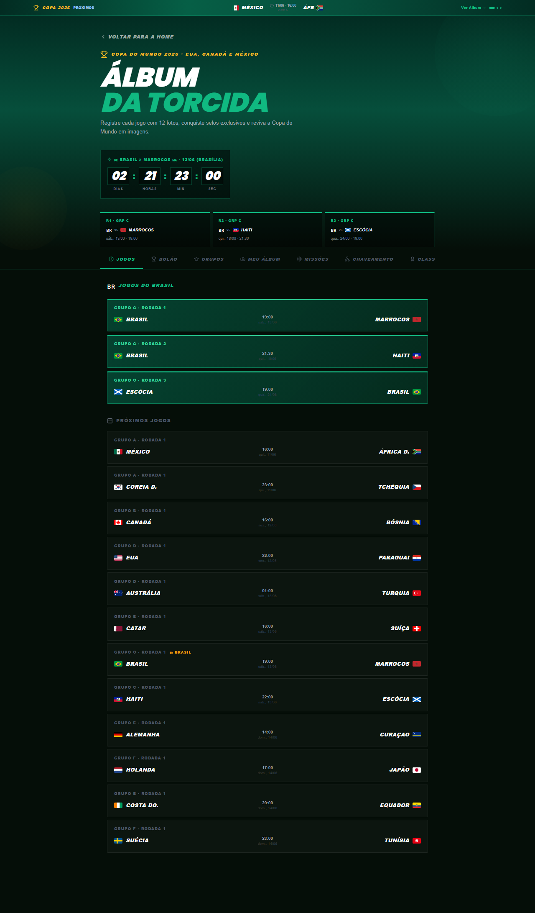

# Manual de Tela — **Álbum da Torcida** — Visualização e figurinhas Copa do Mundo

## ℹ️ Informações Gerais

- **URL:** `/album-torcida`
- **Caminho Resolvido:** `/album-torcida`
- **Nível de Acesso:** `Autenticado`
- **Título da Página (HTML):** `Foto Segundo | Suas memórias, entregues agora.`

## 📸 Captura da Tela

## 🌟 Títulos e Seções Encontradas

- ÁLBUM
DA TORCIDA

## 🔘 Ações e Botões Disponíveis

- **Botão:** `JOGOS`
- **Botão:** `BOLÃO`
- **Botão:** `GRUPOS`
- **Botão:** `MEU ÁLBUM`
- **Botão:** `MISSÕES`
- **Botão:** `CHAVEAMENTO`
- **Botão:** `CLASSIFICAÇÃO`
- **Botão:** `NOSTALGIA`
- **Botão:** `Home`
- **Botão:** `Buscar`
- **Botão:** `Compras`
- **Botão:** `Meus Álbuns`
- **Botão:** `Opções`
- **Botão:** `Indique e Ganhe`
- **Botão:** `Meus Dados`

## 🔗 Links de Navegação

- **COPA 2026
PRÓXIMOS
MÉXICO
11/06 · 16:00
GRP A
ÁFR
Ver Álbum →** -> `/album-torcida`
- **VOLTAR PARA A HOME** -> `/`

## ⚙️ Observações Técnicas e Fluxo

1. **Acesso:** O carregamento requer privilégios de tipo `Autenticado`.
2. **Responsividade:** Layout testado em formato desktop (1280x1080) e mobile.
