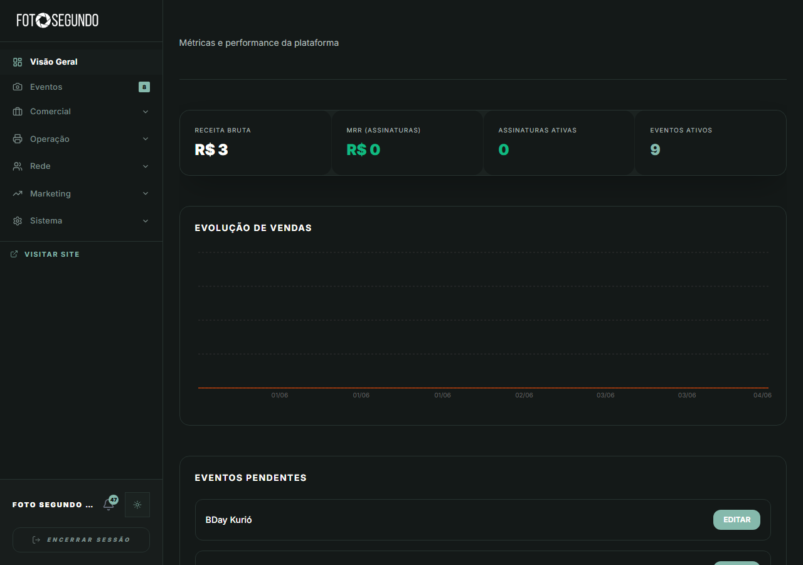

# Manual de Uso — Painel Administrativo

**URL:** https://foto-segundo.vercel.app/admin  
**Gerado em:** 2026-06-04  
**Acesso:** ADMIN apenas

---

## Screenshot (Visão Geral)

---

## 📋 Propósito da Página

Central de controle total da plataforma Foto Segundo. Permite ao administrador monitorar métricas, gerenciar usuários, eventos, finanças, rede de profissionais e configurações do sistema.

---

## 🧭 Menu Lateral — Módulos do Admin

| Grupo         | Item de Menu       | URL (`?s=`)             | Função                                                  |
| ------------- | ------------------ | ----------------------- | ------------------------------------------------------- |
| —             | **Visão Geral**    | `/admin`                | Dashboard com KPIs e gráficos                           |
| —             | **Eventos**        | `?s=eventos`            | Lista de todos os eventos (badge com contagem pendente) |
| **Comercial** | Pedidos            | `?s=pedidos`            | Todos os pedidos da plataforma                          |
| **Comercial** | Cotações           | `?s=cotacoes`           | Propostas de orçamento recebidas                        |
| **Comercial** | Leads              | `?s=leads`              | CRM de oportunidades                                    |
| **Operação**  | Serviços           | `?s=servicos`           | Catálogo de serviços                                    |
| **Operação**  | Catálogo Impressão | `?s=catalogo-impressao` | Produtos para impressão física                          |
| **Operação**  | Fornecedores       | `?s=fornecedores`       | Gestão de fornecedores                                  |
| **Operação**  | Estoque            | `?s=estoque`            | Controle de insumos                                     |
| **Rede**      | Usuários           | `?s=usuarios`           | Todos os usuários cadastrados                           |
| **Rede**      | Aprovação Hub      | `?s=profissionais`      | Aprovação de fotógrafos e serviços                      |
| **Rede**      | Unidades           | `?s=unidades`           | Casas parceiras                                         |
| **Rede**      | Franquias          | `?s=franquias`          | Rede de franqueados                                     |
| **Rede**      | Embaixadores       | `?s=embaixadores`       | Programa de embaixadores                                |
| **Marketing** | Growth             | `?s=growth`             | Métricas de crescimento                                 |
| **Marketing** | Concursos          | `?s=concursos`          | Competições fotográficas                                |
| **Sistema**   | Financeiro         | `?s=financeiro`         | Pagamentos e repasses                                   |
| **Sistema**   | Analytics          | `?s=analytics`          | Relatórios e dados de uso                               |
| **Sistema**   | Configurações      | `?s=configuracoes`      | Configs gerais da plataforma                            |

---

## 🧭 KPIs da Visão Geral

| Métrica                | Descrição                                                    |
| ---------------------- | ------------------------------------------------------------ |
| **Receita Bruta**      | Total de receita acumulada na plataforma                     |
| **MRR (Assinaturas)**  | Receita recorrente mensal                                    |
| **Assinaturas Ativas** | Clientes em plano de assinatura                              |
| **Eventos Ativos**     | Eventos com status ativo no sistema                          |
| **Evolução de Vendas** | Gráfico de linha temporal de vendas                          |
| **Eventos Pendentes**  | Lista de eventos aguardando ação do admin (com botão EDITAR) |

---

## Screenshots das Subseções

| Seção                 | Screenshot                                 |
| --------------------- | ------------------------------------------ |
| Usuários              | `auth_fotosegundo_admin-usuarios.png`      |
| Pedidos               | `auth_fotosegundo_admin-pedidos.png`       |
| Eventos               | `auth_fotosegundo_admin-eventos.png`       |
| Financeiro            | `auth_fotosegundo_admin-financeiro.png`    |
| Aprovação Hub         | `auth_fotosegundo_admin-aprovacao.png`     |
| Serviços              | `auth_fotosegundo_admin-servicos.png`      |
| Unidades              | `auth_fotosegundo_admin-unidades.png`      |
| Growth                | `auth_fotosegundo_admin-growth.png`        |
| Concursos             | `auth_fotosegundo_admin-concursos.png`     |
| Embaixadores          | `auth_fotosegundo_admin-embaixadores.png`  |
| Catálogo de Impressão | `auth_fotosegundo_admin-catalogo.png`      |
| Leads                 | `auth_fotosegundo_admin-leads.png`         |
| Analytics             | `auth_fotosegundo_admin-analytics.png`     |
| Configurações         | `auth_fotosegundo_admin-configuracoes.png` |

---

## ⚙️ Observações Técnicas

- Acesso exclusivo para `role = ADMIN`
- Não autenticados ou outros roles são redirecionados para `/login`
- Badge numérico em "Eventos" indica quantidade de eventos pendentes de revisão
- `VISITAR SITE` no rodapé do menu abre a homepage em nova aba
