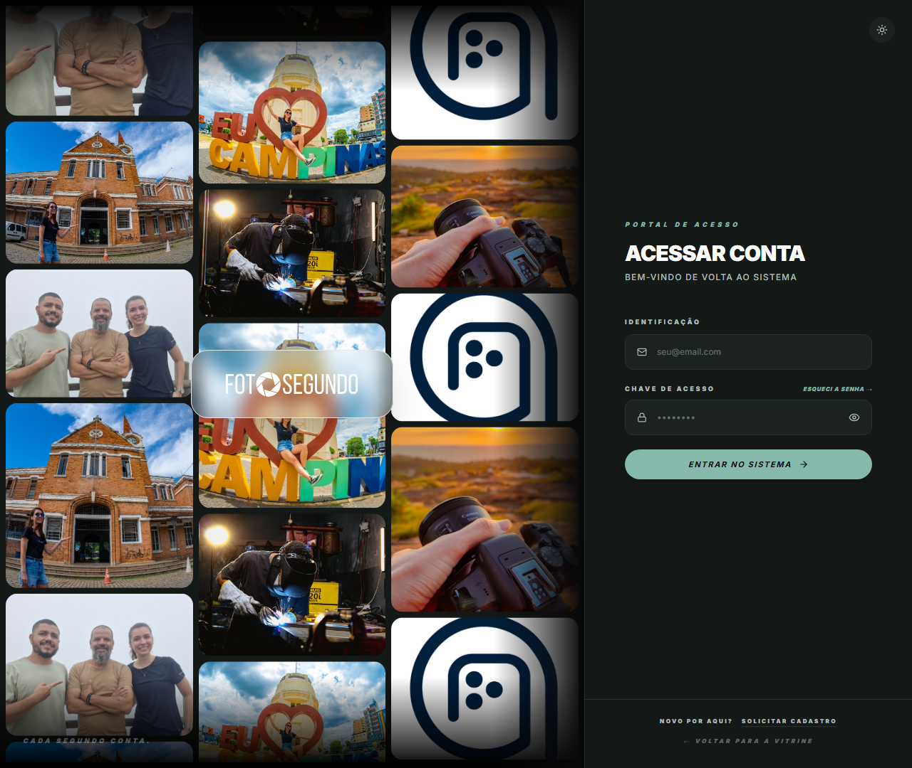

# Manual de Uso: Álbum da Torcida — Copa 2026

O **Álbum da Torcida** é a central de engajamento e gamificação para a Copa do Mundo de 2026 na plataforma **Foto Segundo**. Ele permite que torcedores acompanhem as partidas, visualizem os chaveamentos e grupos, colecionem fotos de seus momentos torcendo em "folhas de álbum" digitais específicas para cada jogo, e revivam a nostalgia de mundiais passados.

---

## 📸 Captura de Tela

---

## 🛠️ Funcionalidades Disponíveis

O painel é estruturado em 4 abas de navegação principais:

### 1. Aba: Jogos

* **Contador de Estreia**: Exibe um relógio em tempo real com a contagem regressiva para a estreia da Seleção Brasileira (Brasil × Marrocos).
* **Jogos do Brasil**: Exibe os confrontos da fase de grupos da seleção com data, hora (horário de Brasília), bandeiras e status do jogo.
* **Próximos Jogos**: Lista os próximos 12 confrontos do torneio de forma cronológica.

### 2. Aba: Grupos

* **Tabela de Grupos**: Apresenta a composição dos 12 grupos (A até L) com bandeiras e identificação das equipes (incluindo destaque dourado com estrela para o Brasil no Grupo C).

### 3. Aba: Meu Álbum

* **Folhas por Partida**: Ao abrir o álbum de uma partida em andamento ou encerrada, o torcedor pode preencher uma folha com **12 fotos** correspondentes a "missões" do jogo (ex: *Churrasco*, *Meu Look*, *Rua Pintada*, *Grito de Gol*).
* **Visualizar Foto e Comentários (Nova Funcionalidade)**: Ao clicar em um slot que já possui foto, abre-se um modal de preview onde o usuário pode ler/escrever uma **legenda ou comentário** personalizado da foto.
* **Substituir Foto**: Dentro do mesmo modal de visualização, o torcedor pode optar por substituir a foto atual por uma nova.
* **Silos de Conquistas (Badges)**: À medida que preenche a folha de um jogo, o usuário desbloqueia conquistas especiais no sistema de gamificação (ex: *Torcedor Fiel*, *Chef da Arena*, *Capitão*).

### 4. Aba: Nostalgia

* **Edições Passadas**: Seleção interativa de Copas anteriores (Catar 2022, Rússia 2018, Brasil 2014, África 2010).
* **Slots Personalizados**: Envio de fotos antigas com persistência local (`localStorage`) para registrar lembranças da torcida.
* **Convidar Amigos**: Permite gerar um link de compartilhamento e enviar diretamente por **WhatsApp** para chamar amigos para colaborar no álbum ou reagir às fotos.
* **Mural da Galera**: Feed simulado com posts e fotos de outros torcedores da comunidade, suportando reações em formato de "coração/likes" dinâmicos.

---

## 🔄 Fluxo de Trabalho Recomendado

1. **Acompanhar a Estreia**: Visualize a contagem regressiva e ative sua folha de álbum assim que o jogo do Brasil for iniciado.
2. **Preencher a Folha do Jogo**: Suba fotos do seu celular para cada um dos slots do jogo ativo.
3. **Adicionar Legendas**: Clique na foto enviada para adicionar uma descrição memorável e guardá-la no álbum.
4. **Resgatar a Nostalgia**: Vá à aba "Nostalgia", suba suas fotos das Copas passadas e clique em "Convidar Amigos" para compartilhar seu link de memórias pelo WhatsApp.
