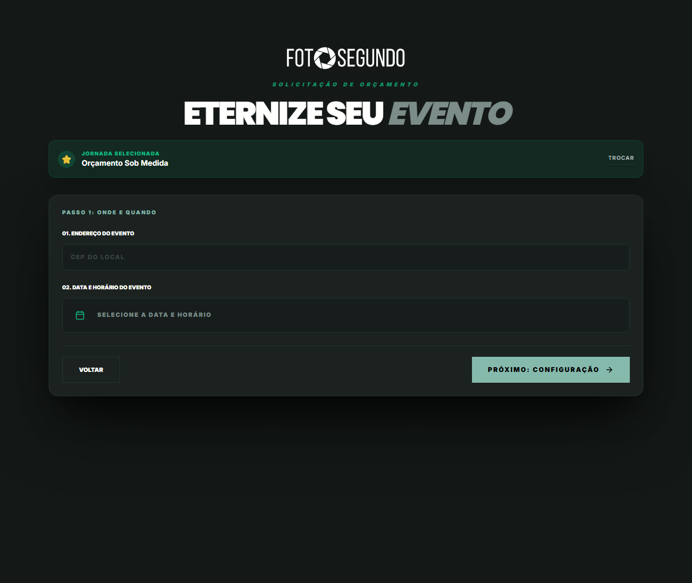

# Manual de Uso — Cotação: Customizado

**URL:** https://foto-segundo.vercel.app/cotacao/customizado  
**Gerado em:** 2026-06-04 | **Acesso:** Público



## Propósito

Fluxo de cotação totalmente personalizado onde o usuário **monta sua cobertura serviço por serviço**. Ideal para eventos complexos, corporativos ou com necessidades específicas.

## Serviços Selecionáveis (a la carte)

- Horas de cobertura fotográfica (avulsas)
- Fotógrafos extras
- Filmmaker / Vídeo
- Drone aéreo
- Impressão local (Photo Booth)
- Aftermovie
- Álbum colaborativo (Vault)
- Cobertura 360°

## Fluxo de Uso

```
1. Seleciona os serviços desejados
2. Define quantidade/duração de cada serviço
3. Informa data, local (CEP) e tipo de evento
4. Recebe proposta de orçamento
5. Aprovação da proposta → Checkout
```

## Observações Técnicas

- O valor final depende de aprovação da proposta pelo time da Foto Segundo
- Prazo de resposta: até 24h úteis
- Disponibilidade sujeita a agenda dos profissionais
