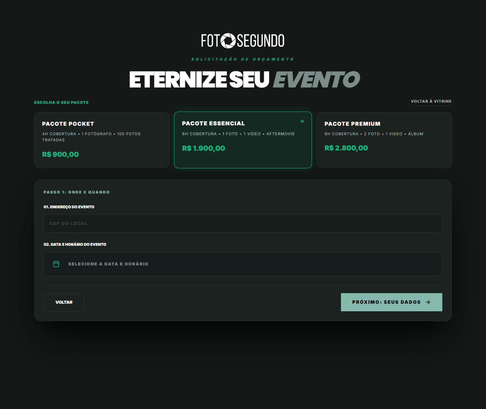

# Manual de Uso — Cotação: Pacotes Fechados

**URL:** https://foto-segundo.vercel.app/cotacao/pacotes  
**Gerado em:** 2026-06-04  
**Acesso:** Público (login exigido no checkout)

---

## Screenshot



---

## 📋 Propósito da Página

Fluxo de contratação de **pacotes fechados** de cobertura fotográfica. O usuário escolhe um pacote e preenche os detalhes do evento em etapas.

---

## 🧭 Etapa 1 — Seleção de Pacote + Local e Data

### Cards de Pacote (3 opções)

| Pacote                  | Composição                                      | Preço           |
| ----------------------- | ----------------------------------------------- | --------------- |
| **PACOTE POCKET**       | 4h Cobertura · 1 Fotógrafo · 100 Fotos Tratadas | **R$ 900,00**   |
| **PACOTE ESSENCIAL** ⭐ | 6h Cobertura · 1 Foto + 1 Vídeo · Aftermovie    | **R$ 1.900,00** |
| **PACOTE PREMIUM**      | 8h Cobertura · 2 Foto + 1 Vídeo · Álbum         | **R$ 2.800,00** |

### Formulário "PASSO 1: ONDE E QUANDO"

| Campo                        | Tipo        | Descrição                                                 |
| ---------------------------- | ----------- | --------------------------------------------------------- |
| **CEP do Local**             | Input texto | CEP do endereço do evento para cálculo de disponibilidade |
| **Data e Horário do Evento** | Date-picker | Seleção da data e hora do evento                          |

### Navegação

| Botão                   | Função                                         |
| ----------------------- | ---------------------------------------------- |
| `VOLTAR`                | Retorna ao passo anterior ou à seleção de tipo |
| `PRÓXIMO: SEUS DADOS →` | Avança para Passo 2 (dados pessoais)           |
| `VOLTAR À VITRINE`      | Cancela e vai para `/vitrine`                  |

---

## 🔄 Fluxo Completo

```
Passo 1: Escolher pacote + CEP + Data
    ↓
Passo 2: Dados pessoais do contratante
    ↓
Passo 3: Confirmar pedido
    ↓
Passo 4: Checkout / Pagamento (exige login)
```

---

## ⚙️ Observações Técnicas

- O Pacote Essencial vem selecionado por padrão (mais vendido)
- CEP é usado para validar raio de atendimento e disponibilidade de profissionais
- Versão mobile usa componente `PackageMobileView` com passos adaptativos
