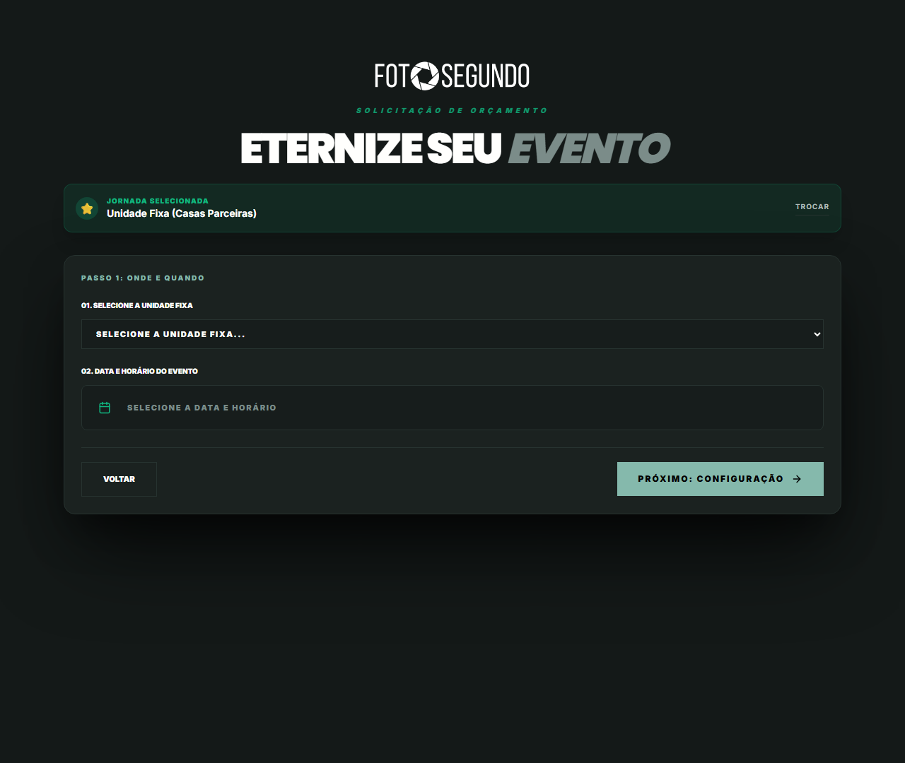

# Manual de Uso — Cotação: Unidades Fixas

**URL:** https://foto-segundo.vercel.app/cotacao/unidades  
**Gerado em:** 2026-06-04 | **Acesso:** Público



## Propósito

Fluxo de cotação para eventos em **casas parceiras cadastradas** (espaços de eventos, restaurantes, cartórios). O usuário seleciona o local parceiro e vê os pacotes exclusivos disponíveis para aquele espaço.

## Fluxo de Uso

```
1. Busca/Seleciona a unidade fixa parceira
2. Visualiza pacotes exclusivos do espaço
3. Seleciona pacote e data disponível
4. Preenche dados do evento
5. Vai para checkout
```

## Diferenciais vs. Pacotes Fechados

- Pacotes otimizados para o espaço físico específico
- Fotógrafos já credenciados e conhecem o local
- Condições comerciais negociadas com a casa parceira
- Equipe especializada no tipo de evento do espaço
