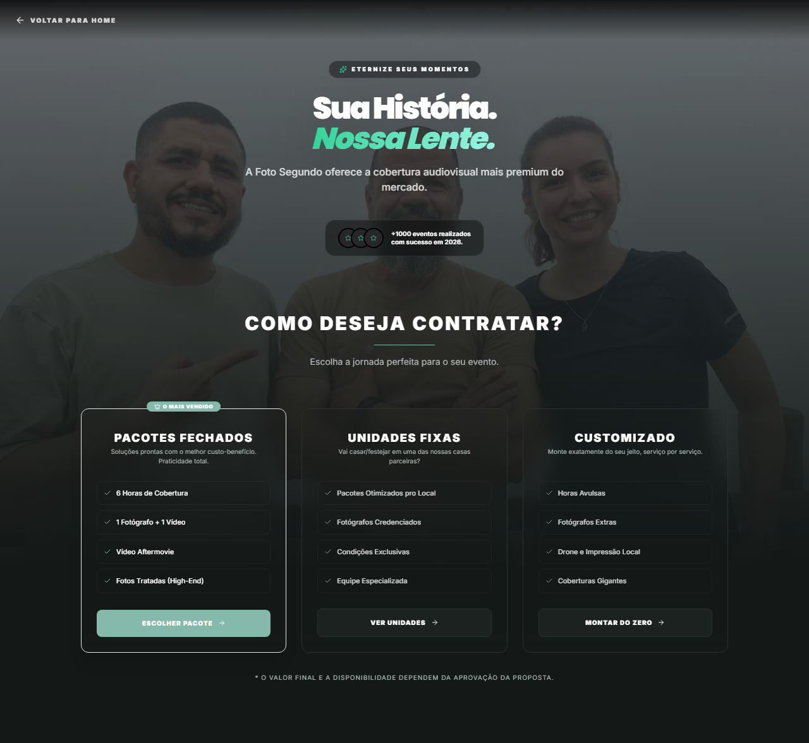
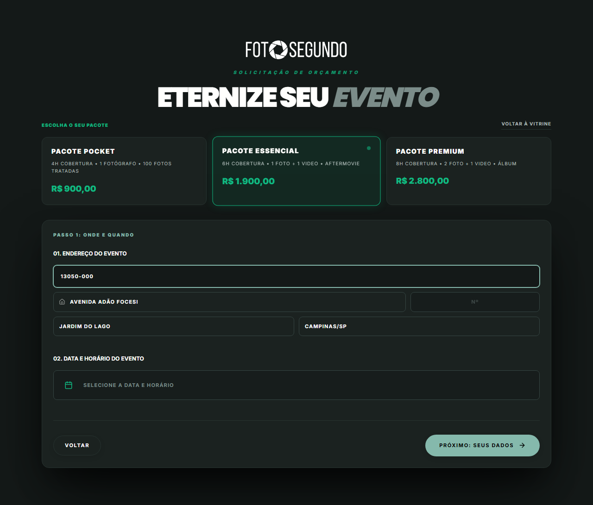

# Manual de Uso — Cotação e Orçamento

**URLs:**

- https://foto-segundo.vercel.app/cotacao (Hub de Cotação)
- https://foto-segundo.vercel.app/cotacao/pacotes (Seleção de Pacotes)
  **Gerado em:** 2026-06-04  
  **Acesso:** Público (requer login nas etapas finais)

---

## 📋 Propósito da Página

O fluxo de cotação é o principal funil de vendas da Foto Segundo. Nele, o cliente escolhe o tipo de serviço desejado, seleciona um pacote de cobertura, preenche os dados do evento e segue para o checkout seguro.

---

## 🧭 Hub de Cotação (`/cotacao`)

Página inicial do funil onde o usuário decide a categoria do evento:

- **Pacotes Prontos** — Opções fechadas para eventos sociais e corporativos (fluxo principal).
- **Projetos Especiais** — Cotação sob medida para casamentos ou grandes produções.
- **Serviços Avulsos** — Contratação por hora ou serviços específicos (ex: apenas drone).

> O fluxo mais comum é o de **Pacotes Prontos**, que redireciona para `/cotacao/pacotes`.

---

## 🧭 Fluxo de Pacotes (`/cotacao/pacotes`)

### Passo 1: Onde e Quando

1. **Escolha o Pacote**:
   - **Pocket** (R$ 900) - 4h, 1 Fotógrafo, 100 fotos.
   - **Essencial** (R$ 1.900) - 6h, 1 Foto + 1 Vídeo + Aftermovie.
   - **Premium** (R$ 2.800) - 8h, 2 Foto + 1 Vídeo + Álbum impresso.
2. **Endereço do Evento**: O usuário insere o CEP, e o sistema preenche automaticamente rua, bairro e cidade (integração ViaCEP). Deve-se preencher o número do local.
3. **Data e Horário**: Modal de calendário para escolher o dia e a hora de início da cobertura.

> **Botão `PRÓXIMO: SEUS DADOS →`**

### Passo 2: Seus Dados

- Coleta de nome, e-mail e telefone/WhatsApp do contratante.
- Se o usuário já estiver logado, esses dados são auto-preenchidos.

### Passo 3: Resumo e Pagamento (Checkout)

- Tela de confirmação com todos os dados do evento e valores.
- **Campo de Cupom**: Permite inserir códigos promocionais (ex: `VIP100`). O valor é recalculado imediatamente.
- **Botão Final**: Encaminha o usuário para o gateway de pagamento (Mercado Pago / Stripe).

---

## ⚙️ Observações Técnicas

- O sistema bloqueia datas que já estão com a capacidade máxima de fotógrafos atingida.
- O CEP preenchido calcula a viabilidade de atendimento (algumas regiões podem ter taxa de deslocamento extra).
- O fluxo retém as informações no navegador (Local Storage) caso o usuário saia acidentalmente, permitindo retomar de onde parou.
