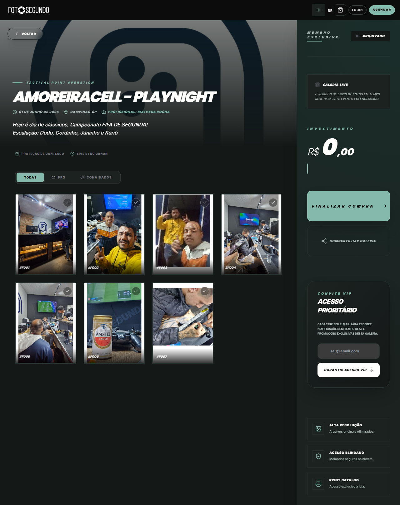

# Manual de Uso — Página do Evento

**URL:** https://foto-segundo.vercel.app/e/:slug  
**Gerado em:** 2026-06-04  
**Acesso:** Público (mas com proteção de fotos e restrições de alta resolução)

---

## Screenshot

---

## 📋 Propósito da Página

Esta é a galeria pública de um evento finalizado. Ela serve para compartilhar as fotos (tanto do fotógrafo quanto dos convidados) de forma protegida (com marca d'água / baixa resolução), permitindo a visualização e oferecendo opções para adquirir as fotos em alta resolução ou liberar acesso completo.

---

## 🧭 Estrutura da Página

### Cabeçalho do Evento (Área Principal)

- **Capa do Evento:** Imagem de destaque (blurred/escura) no fundo.
- **Título do Evento:** (ex: AMOREIRACELL - PLAYNIGHT)
- **Metadados:** Data, Local (cidade/estado) e Nome do Profissional responsável.
- **Descrição:** Breve texto descritivo do evento ("Escalação: Dodo, Gordinho...").
- **Badges de Segurança:** "PROTEÇÃO DE CONTEÚDO", "LIVE SYNC CANON".

### Galeria de Fotos (Filtros e Grid)

- **Filtros de Origem:** `TODAS` | `PRO` (fotos do fotógrafo oficial) | `CONVIDADOS` (fotos upadas via Live Point pelos convidados).
- **Grid de Fotos:** Cada foto possui uma numeração de referência (ex: `#F001`) e uma caixa de seleção (checkbox no canto superior direito) para que o usuário possa selecionar fotos específicas para compra avulsa (se habilitado).

### Barra Lateral Direita (Ações e Conversão)

- **Status do Álbum:** Indica se está "ARQUIVADO", "ATIVO", etc.
- **Aviso Live:** "Galeria Live - O período de envio de fotos em tempo real foi encerrado."
- **Investimento (Carrinho):** Mostra o valor calculado baseado no plano do evento ou nas fotos selecionadas.
- **CTA Principal:** `FINALIZAR COMPRA >` (Encaminha para checkout / liberação).
- **Compartilhamento:** Botão `COMPARTILHAR GALERIA` (copia o link do evento).
- **Captura de Leads (Convite VIP):** Formulário "ACESSO PRIORITÁRIO" onde convidados podem deixar e-mail para receber notificações e promoções do evento.

---

## 🎯 Ações Disponíveis

| Ação                   | Função                                                                                   |
| ---------------------- | ---------------------------------------------------------------------------------------- |
| `FINALIZAR COMPRA`     | Leva o usuário para o checkout para adquirir acesso VIP ou pacote de fotos               |
| `COMPARTILHAR GALERIA` | Copia o link para a área de transferência para envio no WhatsApp/redes sociais           |
| `GARANTIR ACESSO VIP`  | Captura o lead do convidado interessado                                                  |
| Selecionar Fotos       | O usuário pode marcar as fotos no grid (se a modalidade de venda permitir compra avulsa) |

---

## ⚙️ Observações Técnicas

- As imagens carregadas inicialmente são miniaturas (thumbnails) ou possuem proteção para evitar download não autorizado. A alta resolução ("Arquivos originais otimizados") só é liberada após a compra.
- A página se adapta conforme as permissões: se o usuário logado for o proprietário que já pagou, a página não mostrará cobrança, mas sim a opção de download.
