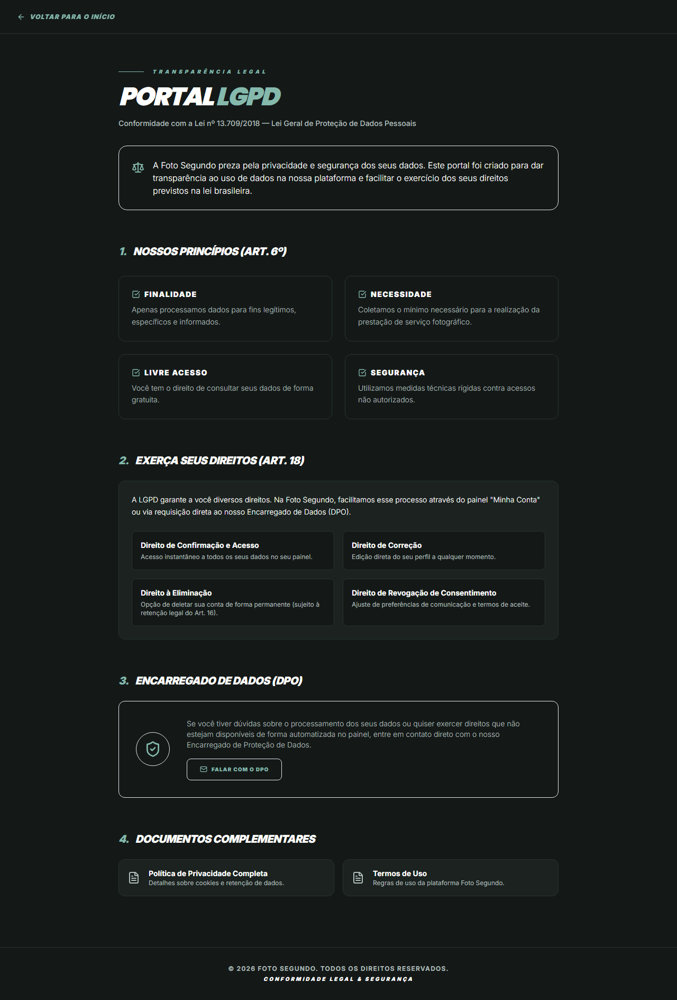

# Manual de Uso — LGPD

**URL:** https://foto-segundo.vercel.app/lgpd  
**Gerado em:** 2026-06-04 | **Acesso:** Público

## Propósito

Página dedicada à conformidade com a Lei Geral de Proteção de Dados (Lei 13.709/2018). Explica os direitos dos titulares e como exercê-los junto à Foto Segundo.

## Direitos do Titular (LGPD)

- Confirmação e acesso aos dados
- Correção de dados incompletos ou inexatos
- Anonimização, bloqueio ou eliminação
- Portabilidade dos dados
- Revogação do consentimento
- Solicitação de exclusão de conta e dados via `/contato`
