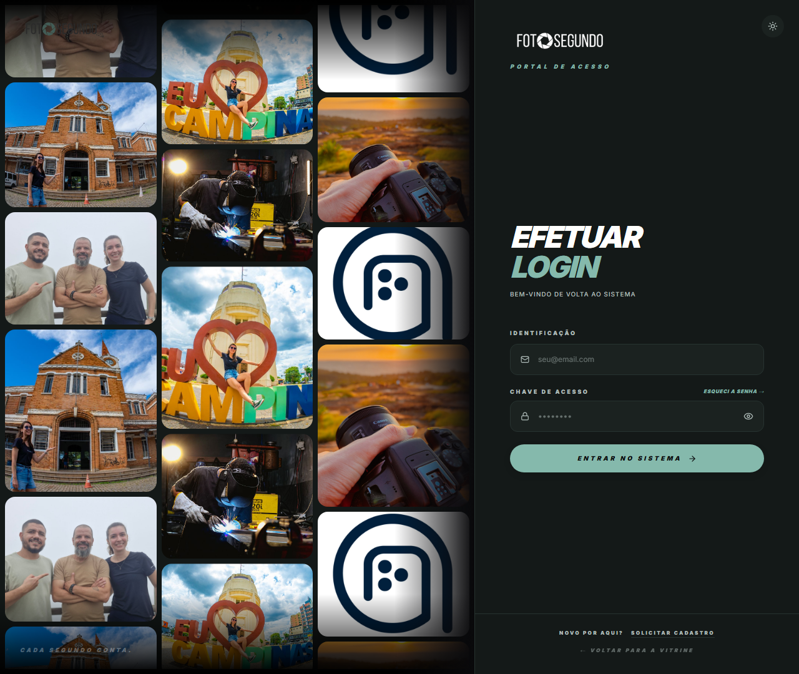

# Manual de Uso — Login / Portal de Acesso

**URL:** https://foto-segundo.vercel.app/login  
**Gerado em:** 2026-06-04  
**Acesso:** Público (redireciona autenticados para dashboard)

---

## Screenshot



---

## 📋 Propósito da Página

Portal de acesso à plataforma Foto Segundo. Layout dividido em dois painéis: **esquerda** com mosaico de fotos de eventos reais, **direita** com o formulário de login.

---

## 🧭 Elementos do Formulário

| Campo                     | Tipo           | Descrição                                                |
| ------------------------- | -------------- | -------------------------------------------------------- |
| **Identificação**         | Input e-mail   | Campo para inserir o e-mail cadastrado (`seu@email.com`) |
| **Chave de Acesso**       | Input senha    | Campo de senha com toggle para mostrar/ocultar (`👁`)    |
| `ESQUECI A SENHA →`       | Link           | Redireciona para `/forgot-password`                      |
| `ENTRAR NO SISTEMA →`     | Botão primário | Submete o formulário de login                            |
| `NOVO POR AQUI?`          | Texto          | Label do link de cadastro                                |
| `SOLICITAR CADASTRO`      | Link           | Redireciona para `/registro`                             |
| `← VOLTAR PARA A VITRINE` | Link           | Retorna para `/vitrine`                                  |

---

## 🔄 Fluxo de Uso

```
1. Usuário acessa /login
2. Preenche e-mail e senha
3. Clica em "ENTRAR NO SISTEMA"
4. Sistema autentica via Supabase
5. Redirecionamento automático baseado no role:
   - ADMIN → /admin
   - PROFISSIONAL / CARTORIO / UNIDADE / FRANCHISEE / CLIENTE → /minha-conta
```

---

## ⚙️ Observações Técnicas

- Se o usuário já estiver autenticado, é redirecionado automaticamente
- Suporte a parâmetro `?redirect=/url` para retornar à página de origem após login
- Erros de autenticação são exibidos em toast (Sonner)
