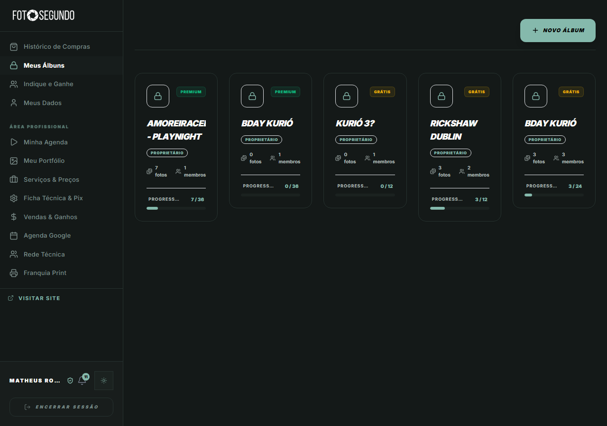

# Manual de Uso — Meus Álbuns

**URL:** https://foto-segundo.vercel.app/meus-albuns  
**Gerado em:** 2026-06-04  
**Acesso:** Autenticado

---

## Screenshot

---

## 📋 Propósito da Página

Visualização e gestão de todos os álbuns de fotos (Vaults) aos quais o usuário tem acesso, seja como proprietário ou membro. Permite o desbloqueio, acompanhamento de progresso e adição de novos álbuns.

---

## 🧭 Estrutura da Página

### Cabeçalho

- **Botão `+ NOVO ÁLBUM`** — Permite criar ou resgatar um novo álbum usando um código de convite ou QR Code.

### Cards de Álbuns (Vaults)

Cada álbum é representado por um card contendo:

- **Status do Álbum:**
  - Ícone de cadeado (fechado ou aberto, dependendo do progresso/compra).
  - Badge de plano do álbum: `PREMIUM` ou `GRÁTIS`.
- **Nome do Evento/Álbum** (ex: BDAY KURIÓ).
- **Badge de Papel/Role:** `PROPRIETÁRIO` (ou `MEMBRO`).
- **Estatísticas:**
  - Número de fotos disponíveis.
  - Número de membros participantes.
- **Progresso:**
  - Barra de progresso indicando o limite de fotos (ex: 7/36, 0/12).
  - Serve para orientar usuários do plano Grátis sobre o limite do cofre.

---

## 🎯 Ações Disponíveis

| Ação           | Função                                                              |
| -------------- | ------------------------------------------------------------------- |
| Clicar no Card | Acessa os detalhes e fotos do álbum específico (`/meus-albuns/:id`) |
| `+ NOVO ÁLBUM` | Abre modal para iniciar novo vault ou entrar em existente           |

---

## ⚙️ Observações Técnicas

- Acesso restrito a usuários logados.
- Integração com a sidebar padrão de área logada.
- O progresso de fotos é restrito no plano `GRÁTIS` e expandido em `PREMIUM`.
