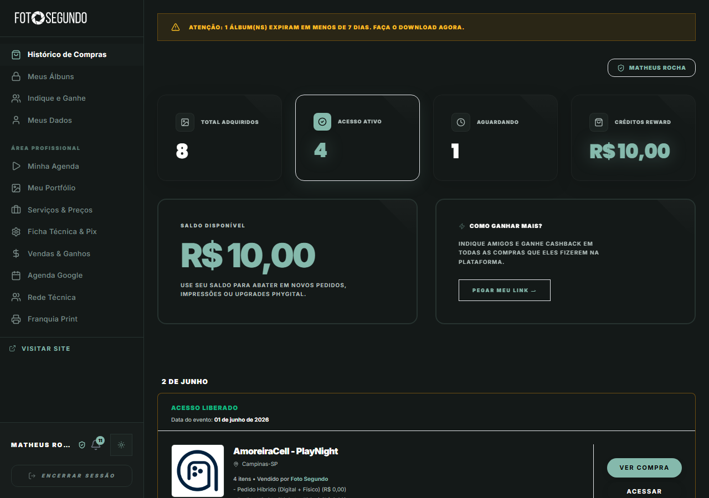

# Manual de Uso — Minha Conta (Dashboard Geral)

**URL:** https://foto-segundo.vercel.app/minha-conta  
**Gerado em:** 2026-06-04  
**Acesso:** Autenticado (todos os roles)

---

## Screenshot (visão PROFISSIONAL — Matheus Rocha)

---

## 📋 Propósito da Página

Painel central do usuário autenticado. Exibe um **resumo de atividade**, saldo de créditos e o histórico de pedidos/álbuns. O menu lateral adapta as opções conforme o role do usuário.

---

## 🧭 Menu Lateral — Navegação

### Área do Cliente (todos os roles)

| Item                     | URL destino    | Descrição                            |
| ------------------------ | -------------- | ------------------------------------ |
| **Histórico de Compras** | `?s=files`     | Lista de todos os pedidos realizados |
| **Meus Álbuns**          | `/meus-albuns` | Cofres (vaults) de fotos do usuário  |
| **Indique e Ganhe**      | `?s=affiliate` | Programa de indicação e cashback     |
| **Meus Dados**           | `?s=perfil`    | Dados pessoais e foto de perfil      |

### Área Profissional (role PROFISSIONAL / ADMIN)

| Item                    | URL destino     | Descrição                                 |
| ----------------------- | --------------- | ----------------------------------------- |
| **Minha Agenda**        | `?s=agenda`     | Próximos eventos agendados                |
| **Meu Portfólio**       | `?s=portfolio`  | Gestão de fotos do portfólio              |
| **Serviços & Preços**   | `?s=servicos`   | Pacotes e serviços ofertados              |
| **Ficha Técnica & Pix** | `?s=perfil`     | Dados bancários e perfil profissional     |
| **Vendas & Ganhos**     | `?s=financeiro` | Relatório financeiro e repasses           |
| **Agenda Google**       | —               | Sincronização com Google Calendar         |
| **Rede Técnica**        | —               | Equipe técnica associada                  |
| **Franquia Print**      | —               | Acesso ao sistema de impressão franqueado |

---

## 🧭 Cards de Resumo (topo)

| Card                 | Descrição                                          |
| -------------------- | -------------------------------------------------- |
| **Total Adquiridos** | Número total de pedidos realizados na plataforma   |
| **Acesso Ativo**     | Álbuns com acesso liberado atualmente              |
| **Aguardando**       | Pedidos em processamento ou pendentes de pagamento |
| **Créditos Reward**  | Saldo em créditos da plataforma (R$)               |

---

## 🧭 Blocos Principais

| Bloco                 | Conteúdo                                                                           |
| --------------------- | ---------------------------------------------------------------------------------- |
| **Saldo Disponível**  | Créditos acumulados via cashback/indicação — pode ser abatido em novos pedidos     |
| **Como Ganhar Mais?** | CTA do programa de indicação com botão `PEGAR MEU LINK →`                          |
| **Lista de Pedidos**  | Cards cronológicos de pedidos com status, evento, data e botões de acesso ao álbum |

---

## ⚠️ Alertas Inteligentes

- Banner amarelo de aviso quando álbuns estão próximos de expirar (< 7 dias)
- Badge de notificações no avatar (canto inferior esquerdo)

---

## ⚙️ Observações Técnicas

- O menu lateral se adapta conforme o role: CLIENTE vê apenas a área de cliente; PROFISSIONAL vê também a área profissional
- `VISITAR SITE` no rodapé do menu abre a homepage em nova aba
- `ENCERRAR SESSÃO` faz logout e redireciona para `/login`
