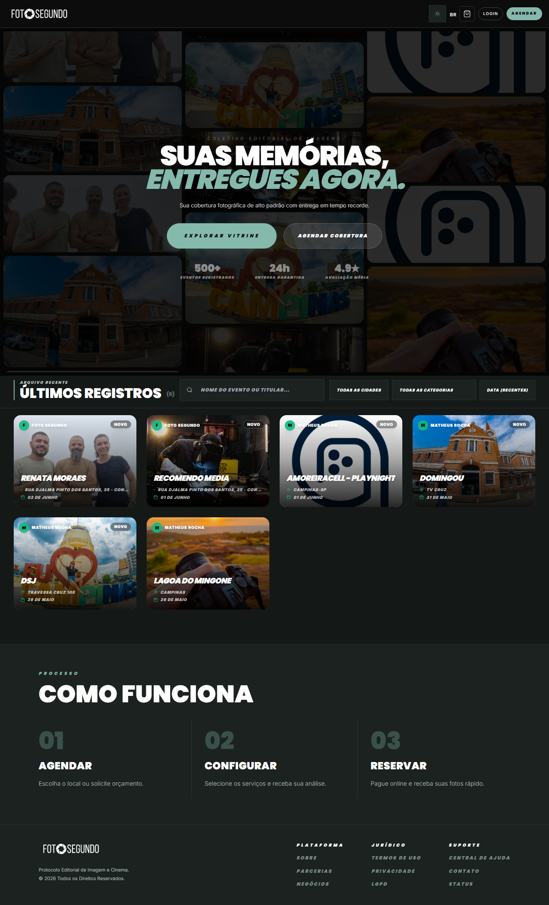

# Manual de Uso — Página Inicial (Home)

**URL:** <https://foto-segundo.vercel.app/>  
**Gerado em:** 2026-06-04  
**Ferramenta:** GSD Manual URL

---

## Screenshot



---

## 📋 Propósito da Página

A **Home** da Foto Segundo é a vitrine pública principal da plataforma. Seu objetivo é apresentar o produto, exibir eventos recentes registrados pelos fotógrafos parceiros e conduzir o usuário para dois fluxos principais: **explorar a vitrine de eventos** ou **agendar uma cobertura fotográfica**.

---

## 🧭 Estrutura e Seções

### 1. Barra de Navegação (Header)

Localizada no topo da página, fixa durante o scroll.

| Elemento                | Tipo                           | Função                                                |
| ----------------------- | ------------------------------ | ----------------------------------------------------- |
| Logo `FOTO○SEGUNDO`     | Link                           | Retorna para a Home `/`                               |
| Ícone de idioma `BR`    | Botão                          | Seleção de idioma                                     |
| Ícone de tema (sol/lua) | Botão                          | Alterna entre tema claro e escuro                     |
| `LOGIN`                 | Botão                          | Abre a página de login `/login`                       |
| `AGENDAR`               | Botão destacado (verde/tático) | Inicia o fluxo de agendamento de cobertura `/cotacao` |

---

### 2. Hero — Seção Principal

Bloco cinematic de tela cheia com mosaico de fotos de eventos ao fundo.

| Elemento                              | Tipo             | Função                                                                   |
| ------------------------------------- | ---------------- | ------------------------------------------------------------------------ |
| **"SUAS MEMÓRIAS, ENTREGUES AGORA."** | Título H1        | Tagline principal da marca                                               |
| Subtítulo                             | Texto            | "Sua cobertura fotográfica de alto padrão com entrega em tempo recorde." |
| `EXPLORAR VITRINE`                    | Botão primário   | Rola a página até a seção de últimos registros / vitrine de eventos      |
| `AGENDAR COBERTURA`                   | Botão secundário | Navega para a página de cotação `/cotacao`                               |
| **500+ Eventos Registrados**          | Indicador        | Estatística de credibilidade da plataforma                               |
| **24h Entrega Garantida**             | Indicador        | Promessa de entrega rápida                                               |
| **4.9★ Avaliação Média**              | Indicador        | Média de avaliações dos clientes                                         |

---

### 3. Últimos Registros — Vitrine de Eventos

Seção com cards dos eventos mais recentes publicados na plataforma.

| Elemento                    | Tipo            | Função                                                                                                     |
| --------------------------- | --------------- | ---------------------------------------------------------------------------------------------------------- |
| **"ÚLTIMOS REGISTROS (N)"** | Título H2       | Cabeçalho da seção com contador de eventos                                                                 |
| Campo de busca              | Input           | Pesquisa por nome do evento ou titular                                                                     |
| `TODAS AS CIDADES`          | Filtro          | Filtra eventos por cidade                                                                                  |
| `TODAS AS CATEGORIAS`       | Filtro          | Filtra eventos por categoria                                                                               |
| `DATA (RECENTES)`           | Filtro de ordem | Ordena por data mais recente                                                                               |
| Card de Evento              | Card clicável   | Cada card exibe: foto cover, nome do evento, fotógrafo, endereço e data. Ao clicar, abre o álbum do evento |
| Badge `NOVO`                | Tag             | Indica eventos publicados recentemente                                                                     |
| Avatar do fotógrafo         | Ícone           | Inicial do fotógrafo responsável                                                                           |

**Eventos exibidos no screenshot:**

- Renata Moraes — 02 de Junho
- Recomendo Media — 01 de Junho
- Amoreiracell - Playnight — 01 de Junho, Campinas-SP
- Domingou — 31 de Maio, TV Cruz
- DSJ — 29 de Maio, Travessa Cruz 105
- Lagoa do Mingone — 26 de Maio, Campinas

---

### 4. Como Funciona — Processo de 3 Passos

Seção educativa que explica o fluxo da plataforma para novos usuários.

| Passo | Título         | Descrição                                   |
| ----- | -------------- | ------------------------------------------- |
| 01    | **AGENDAR**    | Escolha o local ou solicite orçamento.      |
| 02    | **CONFIGURAR** | Selecione os serviços e receba sua análise. |
| 03    | **RESERVAR**   | Pague online e receba suas fotos rápido.    |

---

### 5. Footer (Rodapé)

Organizado em colunas temáticas.

| Coluna         | Links disponíveis                 |
| -------------- | --------------------------------- |
| **PLATAFORMA** | Sobre, Parcerias, Negócios        |
| **JURÍDICO**   | Termos de Uso, Privacidade, LGPD  |
| **SUPORTE**    | Central de Ajuda, Contato, Status |

Rodapé inclui o logo da marca e a nota de copyright: _"Protocolo Editorial de Imagem e Cinema. © 2026 Todos os Direitos Reservados."_

---

### 6. Barra de Navegação Mobile (Bottom Nav)

Visível apenas em dispositivos móveis, fixada na parte inferior da tela.

| Ícone | Label              | Função                      |
| ----- | ------------------ | --------------------------- |
| 🏠    | Home               | Página inicial              |
| 🔍    | Buscar             | Busca de eventos/fotógrafos |
| 🛍️    | Compras            | Área de pedidos do cliente  |
| 📷    | Meus Álbuns        | Álbuns do usuário           |
| ☰    | Opções             | Menu de configurações       |
| →     | Entrar             | Acesso rápido ao login      |
| 📸    | Vitrine de Eventos | Atalho para a vitrine       |

---

## 🔄 Fluxo Principal de Uso

```
1. Usuário acessa https://foto-segundo.vercel.app/
2. Visualiza o Hero com a tagline e as estatísticas da plataforma
3. Decide entre dois caminhos:

   [A] EXPLORAR VITRINE
       └── Rola até "Últimos Registros"
       └── Usa filtros (cidade, categoria, data) para encontrar eventos
       └── Clica em um card de evento para visualizar o álbum

   [B] AGENDAR COBERTURA
       └── É redirecionado para /cotacao
       └── Escolhe o tipo de serviço (Pacote, Unidade Fixa, Customizado)
       └── Preenche as informações do evento
       └── Faz o pagamento e recebe confirmação

4. Usuário não autenticado pode navegar livremente
5. Para acessar álbuns privados ou comprar, é necessário LOGIN
```

---

## ⚙️ Observações Técnicas

- **Autenticação:** A página funciona completamente sem login. O botão `LOGIN` fica visível no header para usuários não autenticados. Após login, ele é substituído pelo avatar do usuário.
- **Tema:** A plataforma suporta modo claro e escuro via toggle no header (ícone de sol/lua).
- **Responsividade:** A página adapta o layout para mobile com a Bottom Nav substituindo o Header nav.
- **Background Hero:** As fotos no hero são carregadas da API pública de eventos (`/public/events`) e fazem slideshow automático a cada 3 segundos.
- **Contador de Eventos:** O número entre parênteses em "ÚLTIMOS REGISTROS (N)" é dinâmico e reflete a contagem atual de eventos na API.
