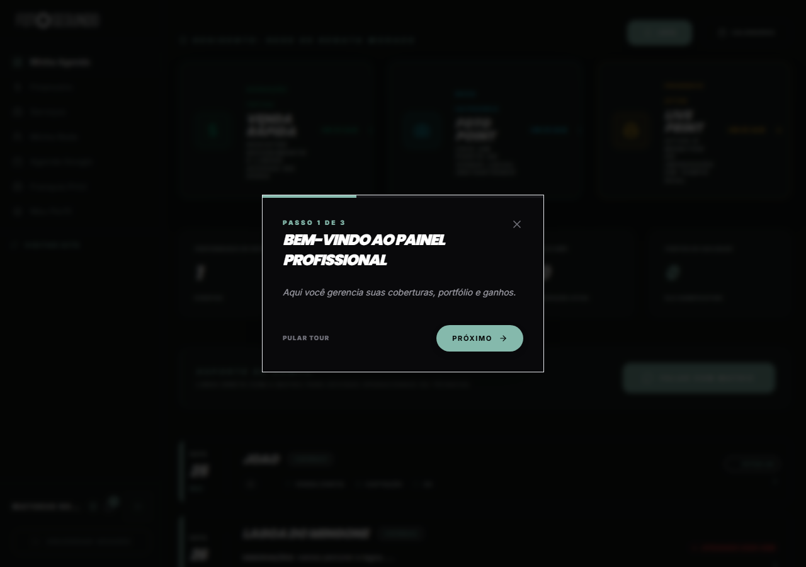

# Manual de Uso — Painel do Profissional

**URL:** https://foto-segundo.vercel.app/profissional  
**Gerado em:** 2026-06-04  
**Acesso:** PROFISSIONAL / ADMIN / FRANCHISEE

---

## Screenshot

---

## 📋 Propósito da Página

Central de operações do fotógrafo/videomaker. Gerencia missões (gamificação), agenda de eventos, portfólio, serviços e ganhos — tudo em um único painel.

---

## 🧭 Onboarding Tour (3 passos)

Na primeira visita, um tour guiado é exibido automaticamente:

| Passo | Título                               | Conteúdo                                               |
| ----- | ------------------------------------ | ------------------------------------------------------ |
| 1/3   | **Bem-vindo ao Painel Profissional** | Apresentação do painel: coberturas, portfólio e ganhos |
| 2/3   | —                                    | Introdução às missões e gamificação                    |
| 3/3   | —                                    | Como receber leads e aceitar eventos                   |

> Botões: `PULAR TOUR` (ignora) ou `PRÓXIMO →` (avança)

---

## 🧭 Seções do Painel

### Sistema de Missões (Gamificação)

Cards horizontais com missões ativas do profissional:

- **Missão Bateria** — completar N coberturas
- **Plano Free/Pro** — nível de assinatura ativo
- **Live Tracker** — rastreamento de eventos ao vivo

### Agenda de Eventos

Lista cronológica de eventos confirmados com:

- Data do evento
- Nome e status (ATIVO / AGUARDANDO)
- Botão de acesso ao monitor de impressão

### Métricas Pessoais

- Avaliação média recebida dos clientes
- Total de eventos realizados
- Ranking na rede de profissionais

---

## 🎯 Ações Disponíveis

| Ação             | Função                                                          |
| ---------------- | --------------------------------------------------------------- |
| `NOVO SERVIÇO`   | Cria um novo serviço customizado (`/profissional/novo-servico`) |
| `PORTFÓLIO`      | Acessa gestão do portfólio (`/profissional/portfolio`)          |
| Clicar em evento | Abre o monitor de impressão do evento                           |
| `PEGAR MEU LINK` | Gera link de compartilhamento do perfil público                 |

---

## ⚙️ Painel de Edição de Evento & Gestão de Equipe

Ao clicar no botão de configurações/ajustes de um evento de sua propriedade, abre-se o modal de edição que agora contém a aba **EQUIPE** para gestão de múltiplos profissionais.

### Funções e Rótulos
- **Fotógrafo Principal:** O criador e dono original do evento é explicitamente identificado sob o rótulo **Fotógrafo Principal**, diferenciando-o do restante da equipe técnica.
- **Outros Membros da Equipe:** Permite buscar profissionais da rede por nome ou e-mail na caixa de pesquisa em tempo real.
- **Funções Dinâmicas:** Ao adicionar um novo membro, é possível selecionar uma das funções disponíveis:
  - `Segundo Fotógrafo`
  - `Assistente`
  - `Videomaker`
- **Remoção de Membros:** O Fotógrafo Principal ou administradores do sistema podem excluir membros da equipe clicando no botão de lixeira correspondente na listagem de equipe.

---

## ⚙️ Observações Técnicas

- O tour de onboarding aparece apenas uma vez (estado salvo no banco)
- Eventos no painel profissional são apenas os atribuídos ao profissional logado
- Base de dados sincronizada com a vitrine pública e central de cotações
- Integração com Google Calendar disponível via `Agenda Google` no menu lateral
