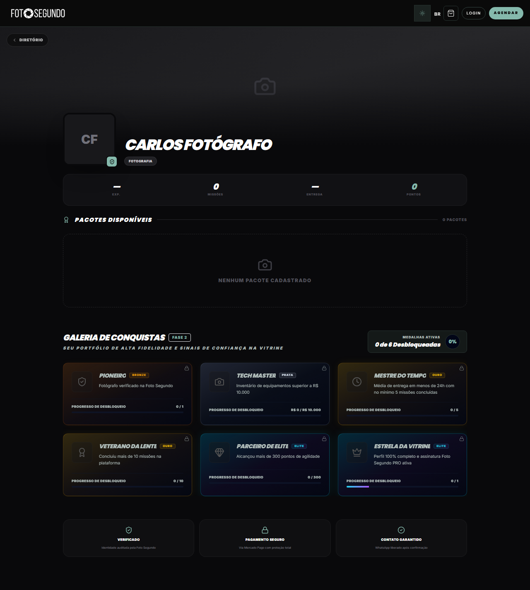

# Manual de Uso — Perfil do Profissional

**URL:** https://foto-segundo.vercel.app/pro/:id  
**Gerado em:** 2026-06-04  
**Acesso:** Público / Autenticado

---

## Screenshot

---

## 📋 Propósito da Página

Vitrine pública de um fotógrafo/videomaker da plataforma. Permite aos clientes visualizarem o portfólio, medalhas/conquistas, pacotes disponíveis e iniciarem um agendamento direto.

---

## 🧭 Estrutura da Página

### Cabeçalho do Perfil

- **Foto de Capa/Perfil** (se configurada)
- **Nome do Profissional** (ex: Carlos Fotógrafo)
- **Especialidade** (ex: Fotografia)
- **Selo de Verificação** (ícone indicando se a identidade foi auditada)

### Métricas de Desempenho

- **Exp.** — Nível de experiência ou tempo na plataforma
- **Missões** — Quantidade de missões concluídas na gamificação
- **Entrega** — Média de tempo para entrega dos materiais
- **Pontos** — Pontuação acumulada no programa de parcerias

### Pacotes Disponíveis

- Lista de pacotes/serviços oferecidos pelo profissional.
- Se vazio, exibe: "NENHUM PACOTE CADASTRADO".

### Galeria de Conquistas

Exibe as medalhas e selos conquistados pelo profissional através do sistema de gamificação ("Fase 2"):

- **Pioneiro** (Bronze) — Fotógrafo verificado
- **Tech Master** (Prata) — Inventário de equipamentos superior a R$ 10.000
- **Mestre do Tempo** (Ouro) — Média de entrega < 24h
- **Veterano da Lente** (Ouro) — Mais de 10 missões concluídas
- **Parceiro de Elite** (Elite) — Mais de 300 pontos de agilidade
- **Estrela da Vitrine** (Elite) — Perfil 100% completo e assinatura PRO ativa

Mostra o progresso de desbloqueio para cada medalha e o percentual total de medalhas ativas.

### Selos de Confiança (Rodapé)

- **Verificado** — Identidade auditada pela Foto Segundo
- **Pagamento Seguro** — Via Mercado Pago com proteção total
- **Contato Garantido** — WhatsApp liberado após confirmação

---

## 🎯 Ações Disponíveis

| Ação               | Função                                                   |
| ------------------ | -------------------------------------------------------- |
| `AGENDAR` (Navbar) | Inicia o fluxo de cotação/agendamento com o profissional |
| `< DIRETÓRIO`      | Retorna para a página `/vitrine`                         |

---

## ⚙️ Observações Técnicas

- As medalhas são dinâmicas e dependem do desempenho real do profissional na plataforma.
- A página utiliza dados públicos, mas o agendamento pode exigir login no decorrer do fluxo.
