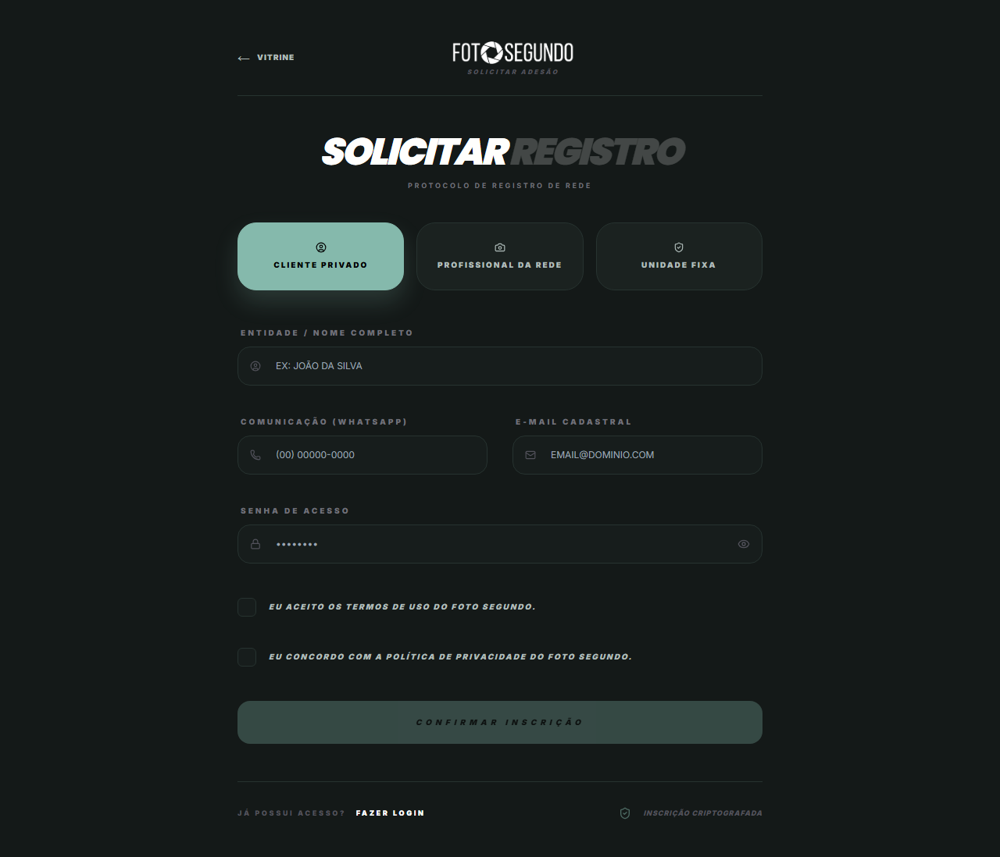

# Manual de Uso — Solicitar Registro (Cadastro)

**URL:** https://foto-segundo.vercel.app/registro  
**Gerado em:** 2026-06-04  
**Acesso:** Público

---

## Screenshot

---

## 📋 Propósito da Página

Formulário de criação de conta na plataforma. Suporta **3 tipos de cadastro** distintos selecionáveis no topo.

---

## 🧭 Seletor de Tipo de Conta

| Tipo                     | Ícone | Descrição                                                      |
| ------------------------ | ----- | -------------------------------------------------------------- |
| **CLIENTE PRIVADO**      | 👤    | Para quem quer contratar cobertura fotográfica ou criar álbuns |
| **PROFISSIONAL DA REDE** | 📷    | Para fotógrafos e videomakers que querem oferecer serviços     |
| **UNIDADE FIXA**         | 🏢    | Para casas de eventos que querem ser parceiras da plataforma   |

---

## 🧭 Campos do Formulário

| Campo                        | Placeholder                | Obrigatório |
| ---------------------------- | -------------------------- | ----------- |
| **Entidade / Nome Completo** | `EX: JOÃO DA SILVA`        | ✅          |
| **Comunicação (WhatsApp)**   | `(00) 00000-0000`          | ✅          |
| **E-mail Cadastral**         | `EMAIL@DOMINIO.COM`        | ✅          |
| **Senha de Acesso**          | `••••••••` (com toggle 👁) | ✅          |
| ☐ Aceitar Termos de Uso      | Checkbox obrigatório       | ✅          |
| ☐ Concordar com Privacidade  | Checkbox obrigatório       | ✅          |

---

## 🎯 Ações Disponíveis

| Elemento                        | Função                             |
| ------------------------------- | ---------------------------------- |
| `CONFIRMAR INSCRIÇÃO`           | Submete o cadastro                 |
| `FAZER LOGIN`                   | Redireciona para `/login`          |
| `← VITRINE`                     | Retorna à vitrine de profissionais |
| Badge `INSCRIÇÃO CRIPTOGRAFADA` | Indicador de segurança             |

---

## ⚙️ Observações Técnicas

- O formulário adapta campos extras conforme o tipo de conta selecionado (ex: PROFISSIONAL pode pedir cidade e especialidade)
- Após o cadastro, o usuário recebe e-mail de confirmação
- Contas UNIDADE FIXA passam por aprovação manual do ADMIN
