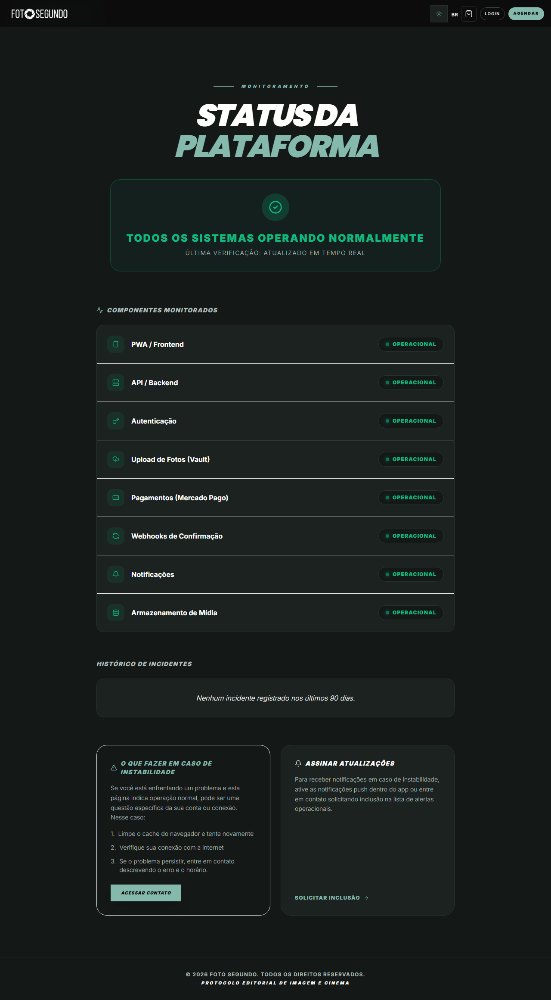

# Manual de Uso — Status da Plataforma

**URL:** https://foto-segundo.vercel.app/status  
**Gerado em:** 2026-06-04 | **Acesso:** Público

## Propósito

Página de monitoramento da saúde da plataforma. Exibe o status em tempo real dos componentes críticos: API, Banco de Dados, Pagamentos e CDN.

## Indicadores Monitorados

- API Backend (Vercel/Hono)
- Banco de Dados (Supabase)
- Gateway de Pagamento (Mercado Pago)
- Armazenamento de Imagens (Supabase Storage)
