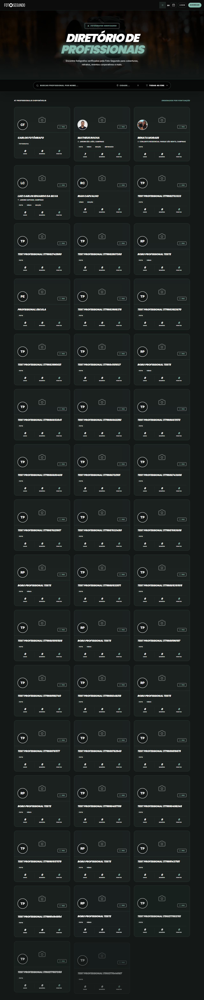

# Manual de Uso — Vitrine de Profissionais

**URL:** https://foto-segundo.vercel.app/vitrine  
**Gerado em:** 2026-06-04  
**Acesso:** Público

---

## Screenshot

---

## 📋 Propósito da Página

Diretório público de todos os **fotógrafos e videomakers verificados** pela Foto Segundo. Permite busca por nome, cidade e filtragem por pontuação (gamificação).

---

## 🧭 Estrutura da Página

### Hero

- **Título:** "DIRETÓRIO DE PROFISSIONAIS"
- **Subtítulo:** "Encontre fotógrafos verificados pela Foto Segundo para coberturas, retratos, eventos corporativos e mais."
- **Badge:** "FOTÓGRAFO VERIFICADO"

### Barra de Filtros

| Filtro                | Tipo        | Função                                              |
| --------------------- | ----------- | --------------------------------------------------- |
| Busca por nome        | Input texto | Filtra profissionais por nome/palavra-chave         |
| Cidade                | Select      | Filtra por cidade de atuação                        |
| Todos as áreas        | Select      | Filtra por especialidade/área                       |
| Ordenar por pontuação | Toggle      | Ordena pelo sistema de gamificação (Agility Points) |

### Grid de Profissionais

- **Layout:** Grade 3 colunas (responsivo)
- **Cada card exibe:**
  - Avatar com inicial do profissional
  - Nome do fotógrafo
  - Cidade de atuação
  - Indicadores: experiência, missões, entrega média, pontos
  - Badge de verificação (quando aplicável)
  - Badge "NOVO" para profissionais recentes

---

## 🎯 Ações Disponíveis

| Ação                           | Resultado                                     |
| ------------------------------ | --------------------------------------------- |
| Clicar em card de profissional | Abre `/pro/:id` com perfil completo e pacotes |
| Buscar por nome                | Filtra lista em tempo real                    |
| Selecionar cidade              | Refiltra pelo servidor                        |
| `LOGIN` (header)               | Acessa portal de login                        |
| `AGENDAR` (header)             | Vai para `/cotacao`                           |

---

## ⚙️ Observações Técnicas

- Apenas profissionais com status APROVADO aparecem na vitrine
- Profissionais sem foto exibem a inicial do nome como avatar
- A contagem de profissionais é exibida no topo da listagem
