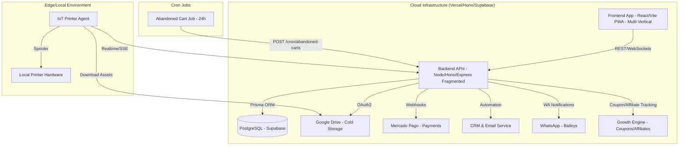

<!-- generated-by: gsd-doc-writer -->
# Project Architecture: Foto Segundo

Este documento descreve a arquitetura técnica da plataforma **Foto Segundo**, focando nos fluxos de dados, infraestrutura de storage, motor de automação phygital, suporte multi-vertical e o Growth Engine de retenção de clientes.

---

## 1. Visão Geral do Sistema (Arquitetura em 9 Módulos)

A plataforma Foto Segundo é um ecossistema **Enterprise** estruturado em 9 camadas de responsabilidade clara:

1. **Cloud Core (Vercel API & Supabase Edge):** Orquestrador hibrido. Uso de Vercel (Hono) para contornar limites de memória do Supabase e fragmentação das Edge Functions.
2. **Persistence Layer (Supabase/Prisma):** Banco de dados relacional com auditoria nativa e assinaturas Realtime (SSE).
3. **Hybrid Cold Storage (Google Drive):** Armazenamento de ativos de alta resolução, otimizado por bundle optimization no Supabase.
4. **Financial Engine (Mercado Pago/PIX):** Fluxo transacional blindado e splits de comissão diretos.
5. **IoT Edge (Printer Agent):** Fulfillment automático de impressões na ponta.
6. **Multi-Vertical UI (Midnight Luxury Theme):** Interface premium e adaptável aos verticais de negócio. Painel 4-tier (Master, Partner, Consumer, Ambassador).
7. **Phygital UX (QR/PIN Access):** Resgate instantâneo de fotos sem fricção.
8. **Retention Engine (CRM & Leads):** Automação de marketing e recuperação de vendas.
9. **Growth Engine (Coupons, Affiliates, WhatsApp):** Aquisição e retenção via programas de indicação e automação de recuperação.

### 🏗️ Componentes Técnicos

- **Core API (Backend):** Hono + Express (Transição Híbrida) + TypeScript.
- **Client App (Frontend):** React + Vite (PWA com Service Worker) e Motor UI Multi-Vertical.
- **IoT Agent (Printer):** Agente Node.js local.
- **Notification Engine:** WhatsApp (Baileys), E-mail (SMTP/Resend).

---

## 2. Estratégia de Storage (Hybrid Multi-Tier)

Para garantir escalabilidade e baixo custo, utilizamos uma estratégia de armazenamento em camadas:

1. **Hot Data (Supabase):** Metadados de usuários, eventos, pedidos e transações financeiras.
2. **Asset Metadata (Prisma):** IDs de arquivos, links de visualização e miniaturas (thumbnails).
3. **Cold Storage (Google Drive):** Arquivos de alta resolução e ativos dos "Cofres de Memórias".
   - **Auth Flow:** Utilizamos **OAuth2 Hybrid Flow** (Refresh Tokens) para garantir que o armazenamento utilize a cota do Google Workspace corporativo, evitando os limites de 0MB das Service Accounts em drives pessoais.

---

## 3. Multi-Vertical Dashboard Architecture (4-Tier)

A plataforma suporta múltiplos verticais de negócio, orquestrados através de um dashboard adaptativo:

### 4-Tier Control Panel
- **Master:** Visão global de todas as franquias e eventos na rede Foto Segundo. Controle financeiro master.
- **Partner (Franchisees/Profissionais):** Visão operacional do evento em curso. Criação de Flash Events (venda de alto volume) e gestão de catálogos customizados.
- **Consumer (Cliente):** Experiência de compra e galeria premium unificada. Visualização de Extratos (Ledger), arquivos comprados, e cofres de memórias.
- **Ambassador:** Dashboard para promotores, acompanhando links gerados, comissões em tempo real via cupom e engajamento.

### Verticais de Negócios

A interface e as regras de negócio se adaptam aos seguintes modelos:
| Vertical | Schema | Feature Única | Autenticação |
|----------|--------|---------------|--------------|
| `FASHION` / `EVENT` / `COTIDIANO` | Padrão | Galeria pública / Flash Event / Custom Services | Opt-in |
| `SCHOOL` (Escolar) | `StudentList` | Seleção de aluno antes do acesso | Forçada por turma |
| `SPORTS` (Esportes) | `BibNumber` | Busca por número de dorsal | Opt-in |
| `NAUTICO` / `GASTRONOMIA` / `VAREJO` | Dinâmico | Customização dinâmica de UI baseada em flags multi-verticais. | Opt-in |

---

## 4. Backend Infrastructure Scaling

O crescimento exigiu adaptações críticas à infraestrutura serverless original.

### Supabase & Vercel (Hono Hybrid)
- **Fragmentation Strategy:** Para lidar com os limites de 20MB de tamanho (bundle limit) nas Supabase Edge Functions e 256MB de uso de memória, a arquitetura agora utiliza uma técnica de fragmentação onde rotas pesadas (Processamento de Imagens, Drive Sync Engine) foram migradas para Vercel Serverless Functions usando **Hono** para extrema performance e controle fino do runtime.
- **Bundle Optimization:** Módulos pesados não essenciais foram marcados como externos no bundle das Edge functions, e dependências pesadas de PDF e image processing (Sharp/Canvas) agora rodam exclusivamente nos workers dedicados no lado do Vercel/Node e não na Edge Runtime Deno do Supabase.

---

## 5. Fluxos de Eventos Críticos

### ⚡ Flash Event & Custom Services
1. **Geração:** Fotógrafo agenda evento relâmpago ou um cliente aprova um serviço customizado (`CustomServiceForm.tsx`).
2. **Review Administrativo (SVC-SUBMIT):** Administradores aprovam, rejeitam ou mantêm exclusividade na rede (publicando ao `ServiceCatalog`).
3. **Captura:** O fotógrafo sobe as fotos vinculando-as ao `ShortID`.

### 🖨️ Web-to-Print IoT Engine (Serverless Native)
1. **Webhook:** O backend recebe confirmação de pagamento do Mercado Pago e persiste no Supabase.
2. **Queue:** O pedido entra na fila de impressão do evento no PostgreSQL.
3. **Realtime Sync:** O frontend e os agentes de impressão assinam o **Supabase Realtime (WebSockets/SSE)**. Mudanças no banco empurram o evento automaticamente.
4. **Pull/Print:** O agente detecta o pedido push, baixa o ativo do Google Drive e envia para a impressora.

### 📸 Client-Side Photo Compositing & Printing Engine
Composição vetorial em iframe invisível no navegador para impressão de molduras nativas em papel fotográfico (ex: Epson L5290).

### 💰 Growth Engine — Cupom & Afiliado
Rastreamento de conversão via cookie `fs_referral`. Se o preço cai para R$0 com cupom, ocorre o bypass imediato do MercadoPago gerando order FREE.

---

## 6. Segurança e Integridade (Defesa em Profundidade)
- **Auth (Anti-XSS):** JWT (Acesso) via **`httpOnly`, `Secure` e `SameSite=Strict` Cookies**.
- **Rate Limit (Anti-DDoS):** Upstash Redis / Vercel Edge Middleware.
- **Cron Security:** Endpoints protegidos por `CRON_SECRET` e `Bearer` token.
- **Audit:** `GamificationLedger` registra ações críticas no backend e front.

---

## 7. Anti-Padrões Proibidos (Serverless Constraints)
- **Polling:** Proibido uso de `setInterval` para API. Usar WebSockets.
- **Monolito:** Proibido bundle gigantesco de Express no Vercel que eleva Cold Starts.

---

## 8. Component Diagram

---

## 9. Key Abstractions
- **Drive Sync Engine (`backend/src/controllers/marketplace.controller.ts`):** Ingestão massiva em lote e extração Regex.
- **Service Catalog & Custom Pricing (`backend/src/controllers/service_catalog.controller.ts`):** Aprovações admin de `CustomService`.
- **Order Motor (`payment.controller.ts`):** Splits, cupons, e status fulfillment.
- **Admin Controller (`admin.controller.ts`):** Dashboard Master, gerindo verticais.
- **CRM Engine (`crm.service.ts`):** Recuperação de vendas.

<!-- GSD-DOCS-UPDATE: SUPPLEMENTED -->
*Documentação verificada e atualizada automaticamente via GSD-SDK em 2026-06.*
