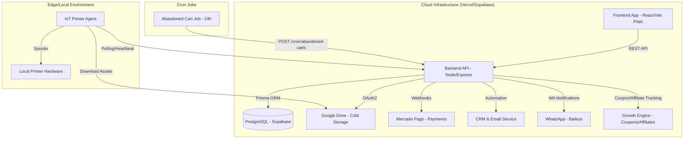

<!-- GSD:ARCHITECTURE -->
# Project Architecture: Foto Segundo

Este documento descreve a arquitetura técnica da plataforma **Foto Segundo**, focando nos fluxos de dados, infraestrutura de storage, motor de automação phygital, suporte multi-vertical e o Growth Engine de retenção de clientes.

---

## 1. Visão Geral do Sistema (Arquitetura em 9 Módulos)

A plataforma Foto Segundo é um ecossistema **Enterprise** estruturado em 9 camadas de responsabilidade clara:

1. **Cloud Core (Vercel/API):** Orquestrador serverless de alta disponibilidade.
2. **Persistence Layer (Supabase/Prisma):** Banco de dados relacional com auditoria nativa.
3. **Hybrid Cold Storage (Google Drive):** Armazenamento de ativos de alta resolução.
4. **Financial Engine (Mercado Pago/PIX):** Fluxo transacional blindado e splits de comissão.
5. **IoT Edge (Printer Agent):** Fulfillment automático de impressões na ponta.
6. **Luxury UI (Midnight Luxury Theme):** Interface premium e responsiva (PWA habilitada).
7. **Phygital UX (QR/PIN Access):** Resgate instantâneo de fotos sem fricção.
8. **Retention Engine (CRM & Leads):** Automação de marketing e recuperação de vendas.
9. **Growth Engine (Coupons, Affiliates, WhatsApp):** Aquisição e retenção via programas de indicação e automação de recuperação.

### 🏗️ Componentes Técnicos

- **Core API (Backend):** Express + TypeScript.
- **Client App (Frontend):** React + Vite (PWA com Service Worker).
- **IoT Agent (Printer):** Agente Node.js local.
- **Notification Engine:** WhatsApp (Baileys), E-mail (SMTP/Resend).

---

## 2. Estratégia de Storage (Hybrid Multi-Tier)

Para garantir escalabilidade e baixo custo, utilizamos uma estratégia de armazenamento em camadas:

1. **Hot Data (Supabase):** Metadados de usuários, eventos, pedidos e transações financeiras.
2. **Asset Metadata (Prisma):** IDs de arquivos, links de visualização e miniaturas (thumbnails).
3. **Cold Storage (Google Drive):** Arquivos de alta resolução e ativos dos "Cofres de Memórias".
   - **Auth Flow:** Utilizamos **OAuth2 Hybrid Flow** (Refresh Tokens) para garantir que o armazenamento utilize a cota do Google Workspace corporativo, evitando os limites de 0MB das Service Accounts em drives pessoais.

---

## 3. Multi-Vertical Business Logic

A plataforma suporta três verticais de fotografia com configuração por evento:

| Vertical | Schema | Feature Única | Autenticação |
|----------|--------|---------------|--------------|
| `FASHION` / `EVENT` | Padrão | Galeria pública / Flash Event | Opt-in |
| `SCHOOL` (Escolar) | `StudentList` | Seleção de aluno antes do acesso | Forçada por turma |
| `SPORTS` (Esportes) | `BibNumber` | Busca por número de dorsal | Opt-in |

Configuração via `event.vertical` (campo no banco) e controlada no `AdminEvents` com toggles por evento.

---

## 4. Fluxos de Eventos Críticos

### ⚡ Flash Event (Venda de Alto Volume)

1. **Geração:** O fotógrafo gera cartões físicos com `ShortID` e `PIN` único.
2. **Captura:** O fotógrafo sobe as fotos vinculando-as ao `ShortID`.
3. **Acesso:** O cliente acessa `/flash/:shortId`, digita o PIN e visualiza a foto em sessão anônima.
4. **Conversão:** Ao clicar em resgatar, o cliente é levado ao registro e a foto é vinculada ao seu `userId` permanentemente.

### 🖨️ Web-to-Print IoT Engine

1. **Webhook:** O backend recebe confirmação de pagamento do Mercado Pago.
2. **Queue:** O pedido entra na fila de impressão do evento.
3. **Heartbeat:** O agente de impressão local envia telemetria constante para o backend.
4. **Pull/Print:** O agente detecta o pedido, baixa o ativo do Google Drive e envia para o spooler da impressora local.

### 📸 Client-Side Photo Compositing & Printing Engine

Para permitir o fulfillment imediato de fotos físicas pelo fotógrafo ou monitor no evento (ex: impressora Epson L5290), implementamos um motor de composição vetorial e rasterizado diretamente no navegador:
1. **Composição em A4:** O painel dinâmico calcula o aproveitamento ideal de papel para tamanhos como `9x13cm`, `10x15cm`, `13x18cm` ou `A4 Inteiro`, calculando automaticamente fotos por folha e orientações de página.
2. **Camadas de Overlays Personalizados:**
   - **Borda Estilizada:** Renderiza bordas com largura (mm) e cores customizadas via Color Picker.
   - **Logo/Marca D'água:** Posicionamento em grid 3x3 com controle de opacidade e tamanho.
   - **Data/Hora e Identificador:** Estampagem dinâmica de códigos de referência e data/hora.
3. **Composição em Iframe Silencioso:** Em vez de abrir novas abas e esticar fotos raw, o motor renderiza um documento HTML encapsulado em um iframe invisível com estilos `@page { size: A4; margin: 0; }` e dispara o `window.print()` nativo do browser de forma síncrona após o pré-carregamento dos assets.
4. **Persistência de Padrão:** As configurações de impressão personalizadas de cada evento são salvas localmente via `localStorage` no dispositivo do monitor para garantir agilidade operacional em impressões subsequentes.

### 💰 Growth Engine — Cupom & Afiliado

1. **Rastreamento:** Usuário acessa via `?ref=<ambassadorId>` — cookie `fs_referral` criado com TTL de 30 dias.
2. **Checkout:** Frontend chama `GET /marketplace/coupons/:code/validate` para validar e aplicar desconto.
3. **Bypass FREE:** Se preço == 0 (cupom 100%), fluxo Mercado Pago é ignorado e ordem é criada com `method: FREE`.
4. **Atribuição:** No webhook de pagamento, `ambassadorId` é lido do cookie e persistido na `Order`.
5. **Recuperação:** Cron job externo chama `POST /cron/abandoned-carts` para disparar e-mails de recuperação após 24h.

### 📱 PWA Lifecycle

1. **Instalação:** Service Worker registrado, Web Manifest configurado com ícones e splash screens.
2. **Cache:** Assets estáticos em cache via estratégia Cache-First.
3. **Push:** Subscrição via `PushManager`, notificações enviadas pelo backend via Web Push Protocol.

---

## 5. Segurança e Integridade

- **Auth:** JWT para sessões curtas e Refresh Tokens para persistência.
- **Cron Security:** Endpoints `/cron/*` protegidos por `CRON_SECRET` via Bearer token.
- **Coupon Security:** Validação server-side de usos máximos, data de expiração e eventId restrito.
- **Cash Payment Security:** Apenas usuários com role `ADMIN | PROFISSIONAL | FRANCHISEE` podem aprovar pagamentos em dinheiro.
- **Audit:** Todas as operações críticas (Logins, Pagamentos, Uploads) são registradas no `GamificationLedger` ou logs de auditoria.

---

## 6. Component Diagram

---

## 7. Key Abstractions

- **Drive Sync Engine (`backend/src/controllers/marketplace.controller.ts`):** Bulk media ingestion from Google Drive with automated Regex-based metadata extraction for school and sports photography verticals.
- **Vault Engine (`backend/src/controllers/vault.controller.ts`):** Manages "Cofres de Memórias" lifecycle, including subscription states and media organization.
- **Order Motor (`backend/src/controllers/payment.controller.ts`):** Orchestrates transaction processing, financial splits, coupon application, ambassador attribution, and fulfillment status.
- **Growth Controller (`backend/src/controllers/growth.controller.ts`):** Handles coupon validation/listing, affiliate management, and WhatsApp session QR.
- **IoT Telemetry (`backend/src/services/iot.service.ts`):** Handles printer agent heartbeat monitoring and device health tracking.
- **Access Controller (`backend/src/controllers/access.controller.ts`):** Manages photo visibility, like system, and QR/PIN-based anonymous access.
- **Admin Controller (`backend/src/controllers/admin.controller.ts`):** Orchestrates administrative event management, multi-vertical configuration, staffing, and system-wide configurations.
- **CRM Engine (`backend/src/services/crm.service.ts`):** Handles automated sales recovery, lead nurturing triggers, and conversion tracking.
- **Abandoned Cart Job (`backend/src/jobs/abandonedCart.job.ts`):** Identifies orders >24h without payment and triggers recovery sequences.
- **WhatsApp Service (`backend/src/services/whatsapp.service.ts`):** Manages Baileys session for automated "Foto Pronta" and cart recovery messages.

---

## 8. Directory Structure Rationale

| Directory | Purpose |
|-----------|---------|
| `/backend` | Core business logic, database models (Prisma), and external integrations. |
| `/frontend` | Multi-profile dashboard UI and Midnight Luxury theme implementation. |
| `/frontend/src/pages/admin/AdminGrowth.tsx` | Admin panel for Coupons, Ambassadors, and WhatsApp QR. |
| `/api` | Vercel-specific deployment entry points. |
| `/printer-agent` | Local IoT agent source code for physical fulfillment. |
| `/e2e` | Playwright E2E test suite. |
| `/docs` | Technical documentation and architectural guides. |
| `/.planning` | GSD framework artifacts (PROJECT, ROADMAP, STATE). |

---

## 9. Deployment

- **Hosting:** Vercel (Frontend e Serverless API).
- **Database:** Supabase (PostgreSQL).
- **ORM:** Prisma Client (conectado via Direct URL para migrações e Connection Pooling para runtime).
- **Cron:** Supabase Cron Jobs ou Vercel Cron chamando `/cron/abandoned-carts`.
