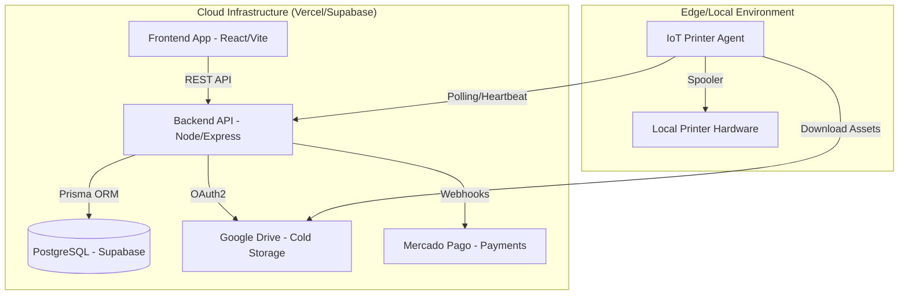

# Project Architecture: Foto Segundo

Este documento descreve a arquitetura técnica da plataforma **Foto Segundo**, focando nos fluxos de dados, infraestrutura de storage e o motor de automação phygital.

---

## 1. Visão Geral do Sistema (Arquitetura em 7 Módulos)

A plataforma Foto Segundo é um ecossistema **Enterprise** estruturado em 7 camadas de responsabilidade clara:

1. **Cloud Core (Vercel/API):** Orquestrador serverless de alta disponibilidade.
2. **Persistence Layer (Supabase/Prisma):** Banco de dados relacional com auditoria nativa.
3. **Hybrid Cold Storage (Google Drive):** Armazenamento de ativos de alta resolução.
4. **Financial Engine (Mercado Pago/PIX):** Fluxo transacional blindado e splits de comissão.
5. **IoT Edge (Printer Agent):** Fulfillment automático de impressões na ponta.
6. **Luxury UI (Midnight Luxury Theme):** Interface premium e responsiva.
7. **Phygital UX (QR/PIN Access):** Resgate instantâneo de fotos sem fricção.

### 🏗️ Componentes Técnicos
- **Core API (Backend):** Express + TypeScript.
- **Client App (Frontend):** React + Vite.
- **IoT Agent (Printer):** Agente Node.js local.

---

## 2. Estratégia de Storage (Hybrid Multi-Tier)

Para garantir escalabilidade e baixo custo, utilizamos uma estratégia de armazenamento em camadas:

1. **Hot Data (Supabase):** Metadados de usuários, eventos, pedidos e transações financeiras.
2. **Asset Metadata (Prisma):** IDs de arquivos, links de visualização e miniaturas (thumbnails).
3. **Cold Storage (Google Drive):** Arquivos de alta resolução e ativos dos "Cofres de Memórias".
   - **Auth Flow:** Utilizamos **OAuth2 Hybrid Flow** (Refresh Tokens) para garantir que o armazenamento utilize a cota do Google Workspace corporativo, evitando os limites de 0MB das Service Accounts em drives pessoais.

---

## 3. Fluxos de Eventos Críticos

### ⚡ Flash Event (Venda de Alto Volume)

1. **Geração:** O fotógrafo gera cartões físicos com `ShortID` e `PIN` único.
2. **Captura:** O fotógrafo sobe as fotos vinculando-as ao `ShortID`.
3. **Acesso:** O cliente acessa `/flash/:shortId`, digita o PIN e visualiza a foto em sessão anônima.
4. **Conversão:** Ao clicar em resgatar, o cliente é levado ao registro e a foto é vinculada ao seu `userId` permanentemente.

### 🖨️ Web-to-Print IoT Engine

1. **Webhook:** O backend recebe confirmação de pagamento do Mercado Pago.
2. **Queue:** O pedido entra na fila de impressão do evento.
3. **Heartbeat:** O agente de impressão local envia telemetria constante para o backend.
4. **Pull/Print:** O agente detecta o pedido, baixa o ativo do Google Drive e envia para o spooler da impressora local.

---

## 4. Segurança e Integridade

- **Auth:** JWT para sessões curtas e Refresh Tokens para persistência.
- **Audit:** Todas as operações críticas (Logins, Pagamentos, Uploads) são registradas no `GamificationLedger` ou logs de auditoria.
- **Validation:** Regras de negócio como a "Meta da Folha A4" (múltiplos de 4) são validadas no backend para evitar desperdício de insumos físicos.

---

## 3. Component Diagram

---

## 4. Key Abstractions

- **Vault Engine (`backend/src/services/vault.service.ts`):** Manages the lifecycle of "Cofres de Memórias", including subscription states and media organization in Google Drive.
- **Order Motor (`backend/src/controllers/payment.controller.ts`):** Orchestrates transaction processing, financial splits, and fulfillment status.
- **IoT Telemetry (`backend/src/services/iot.service.ts`):** Handles printer agent heartbeat monitoring and device health tracking.
- **Access Controller (`backend/src/controllers/access.controller.ts`):** Manages photo visibility, like system, and QR/PIN-based anonymous access.

---

## 5. Directory Structure Rationale

| Directory | Purpose |
|-----------|---------|
| `/backend` | Core business logic, database models (Prisma), and external integrations. |
| `/frontend` | Multi-profile dashboard UI and Midnight Luxury theme implementation. |
| `/api` | Vercel-specific deployment entry points. |
| `/printer-agent` | Local IoT agent source code for physical fulfillment. |
| `/docs` | Technical documentation and architectural guides. |
| `/.planning` | GSD framework artifacts (PROJECT, ROADMAP, STATE). |

---

## 6. Deployment

- **Hosting:** Vercel (Frontend e Serverless API).
- **Database:** Supabase (PostgreSQL).
- **ORM:** Prisma Client (conectado via Direct URL para migrações e Connection Pooling para runtime).
