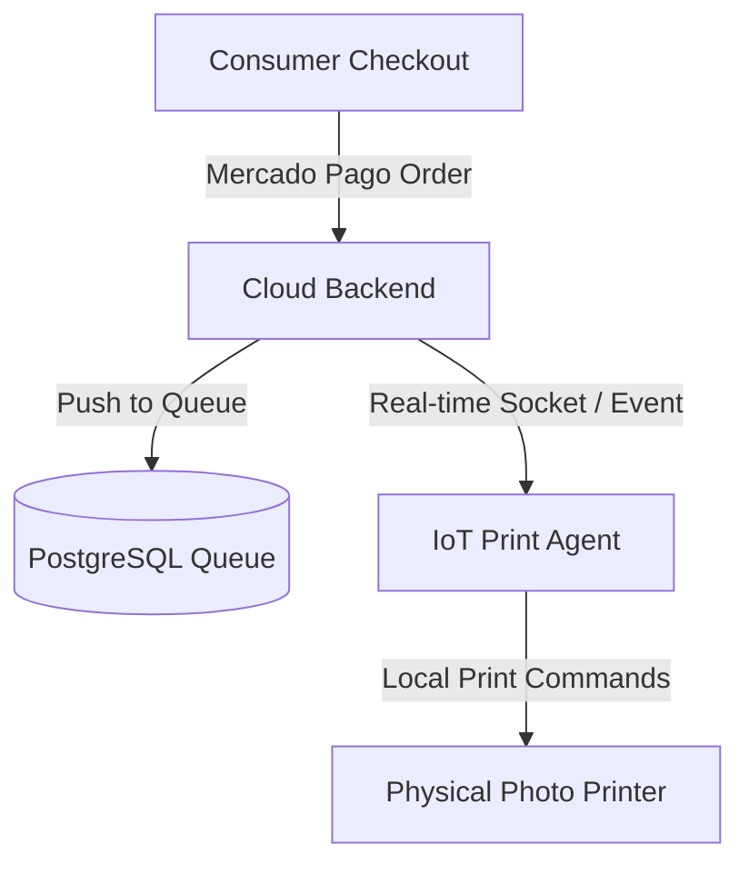

# 01. Architecture Overview - Foto Segundo

Conceptual overview of the platform's architectural patterns, business roles, and communication flows.

## 🏛️ 4-Tier Business Model

Foto Segundo operates on a multi-tier vertical structure to support distinct roles:

1. **Master (Admin)**:
   - Global dashboard to control parameters, transaction fees, and brand configurations.
   - Handles unit/franchise registrations and monitors the network's total financial flow.

2. **Partner (Franchisee / Cartório)**:
   - Regional operations managers.
   - Monitors printing logistics and verifies local physical deliveries.

3. **Professional (Fotógrafo)**:
   - Field professionals capturing events.
   - Manages custom services, uploads media vaults, views schedules, and handles client bookings.

4. **Consumer (Client)**:
   - Browse events or professional galleries.
   - Dynamic stickered album ("Torcida Album"), vault access, checkouts, and physical photo prints.

---

## 🏗️ Backend Design Patterns

The backend is built as a **Service-Oriented Architecture (SOA)** using Node.js, Express, and Prisma ORM.

- **Controller-Service-Repository Model**:
  - **Controllers**: Handle incoming HTTP requests, decode JWTs, parse body parameters, and return response codes.
  - **Services**: House the business rules and state transactions (e.g., `PayoutService`, `OrderService`, `GoogleDriveService`).
  - **Repositories (Prisma Client)**: Manages database interactions with PostgreSQL.
- **Middleware Chain**:
  - **Authentication**: Custom JWT-based access control.
  - **Role-Based Access Control (RBAC)**: Enforces access bounds (e.g., `isAdmin`, `isPartner`, `isProfessional`).
  - **Request Validation**: Sanitizes data payloads before routing to service layers.
  - **Cache Middleware**: In-memory caching for read-heavy resources (like public event listings) to reduce DB load.

---

## 🖼️ Frontend Architecture

The frontend is a single page application (SPA) built with React 19, Vite 8, and custom Vanilla CSS design tokens.

- **Component-Driven Architecture**: Structured, highly reusable components styled to fit the **Midnight Luxury** design guidelines (Harmonious dark color palettes, outfit typography, glassmorphism, smooth micro-animations).
- **Role-Based Routing**: Restricts page access dynamically. Routes are divided into `/admin`, `/partner`, `/professional`, and `/public`.
- **View Transitions**: App-like bottom navigation with native transition animations for desktop and mobile viewports.

---

## 📠 The Phygital Pipeline

A key differentiator of Foto Segundo is the hybrid online-to-offline pipeline:

This ensures that photos purchased digitally are printed and delivered in physical form directly on site.
