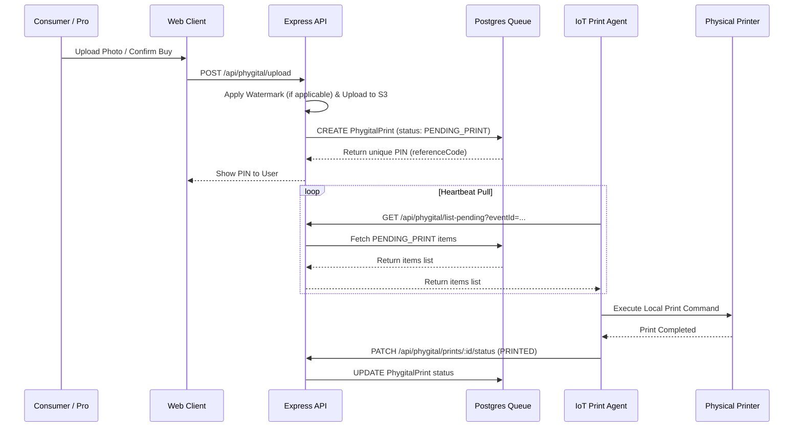

# 06. Phygital Order Engine - Foto Segundo

Documentation of the phygital (physical + digital) photography fulfillment pipeline and the IoT printing agent.

## ⚙️ The Phygital Concept

Foto Segundo bridges the gap between high-end digital photography and physical souvenirs. Consumers scan a QR code at live events (like weddings or corporate parties), upload their photos (or purchase photos taken by the professional), which then trigger automated physical prints immediately on-site.

---

## 🔄 The Lifecycle of a Phygital Print Job

---

## 📟 IoT Print Agent Specification

The printing agent is a lightweight client executing locally in the event space, connected to the physical photo printers (e.g., thermal photo printers).

1. **Authentication**: Connects to the cloud backend using a dedicated authorization header or webhook endpoint.
2. **Polling / Fetching**: Periodically polls `GET /phygital/events/:eventId/prints` to check for new prints.
3. **Local Spooling**: Downloads the target image file and sends standard print commands to the operating system's default printer queue.
4. **Fulfillment Confirmation**: Upon successful print spooling, calls `PATCH /phygital/prints/:id/status` passing `status: PRINTED` (or `FAILED` if a paper jam or error occurs).

---

## 🧪 Simulation & Telemetry

- **Stress Testing Simulation**: The API exposes a `POST /phygital/simulate` endpoint (secured via custom master key `FOTO_SEGUNDO_STRESS_2026`) that registers mock print requests to pressure-test the local agent's throughput.
- **Diagnostics**: Dashboard users (Admin, Cartório, Professionals) can access `/profissional/monitor/:eventId` to check print logs, connection latency, and queue health in real-time.
