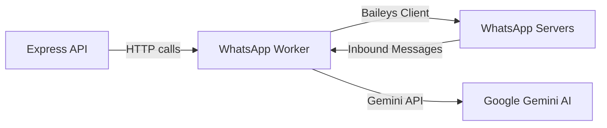

# 07. WhatsApp & AI Attendant Integration - Foto Segundo

Overview of the automated WhatsApp customer service bot and the Google Gemini AI attendant backend.

## 📡 The WhatsApp Worker Architecture

The main backend delegates WhatsApp interactions to a dedicated microservice, the **WhatsApp Worker**, usually hosted at a distinct URL (configured via the `WA_WORKER_URL` environment variable, defaulting to `http://localhost:3005`).

### 1. Connection Engine (`Baileys`)

The worker uses the popular node-based WhatsApp API client library **Baileys** to authenticate and run a WhatsApp web session:

- **QR Code Authentication**: The Admin Dashboard requests `GET /admin/whatsapp/status` to obtain connection status. If disconnected, it calls the status check to generate a QR Code payload, allowing the administrator to link the WhatsApp line.
- **Persistent Sessions**: Once paired, the worker caches session details internally, keeping the bot online across restarts.

---

## 🤖 Gemini AI Attendant Loop

When users interact with the linked WhatsApp line, the worker passes inbound text messages to the Google Gemini model.

### 1. The Context Payload

To supply helpful answers, the worker queries the main backend API to fetch context about:

- **Active Events**: List of recent/ongoing events.
- **Client Orders**: Checks order status (PAGO, PENDENTE) if the client provides their registration details or phone number.
- **Link Retrieval**: Generates secure checkout links or digital album links dynamically.

### 2. Conversational Guardrails

The Gemini assistant uses a curated prompt setting its persona:

- **Tone**: Professional, welcoming, premium, and focused on helping photographers and clients.
- **Tasks**:
  - Explains how to access photo galleries.
  - Generates payment support info.
  - Directs field photographers on how to register and configure print agents.

---

## 🔔 CallMeBot Notification Fallback

For high-priority system notifications (e.g. order paid alerts, payout request confirmations), the backend utilizes **CallMeBot API** as a direct webhook-based messenger:

- Triggered inside `notification.service.ts` using `https://api.callmebot.com/whatsapp.php`.
- Dispatches alert payloads directly to configured admin and photographer phone numbers.
